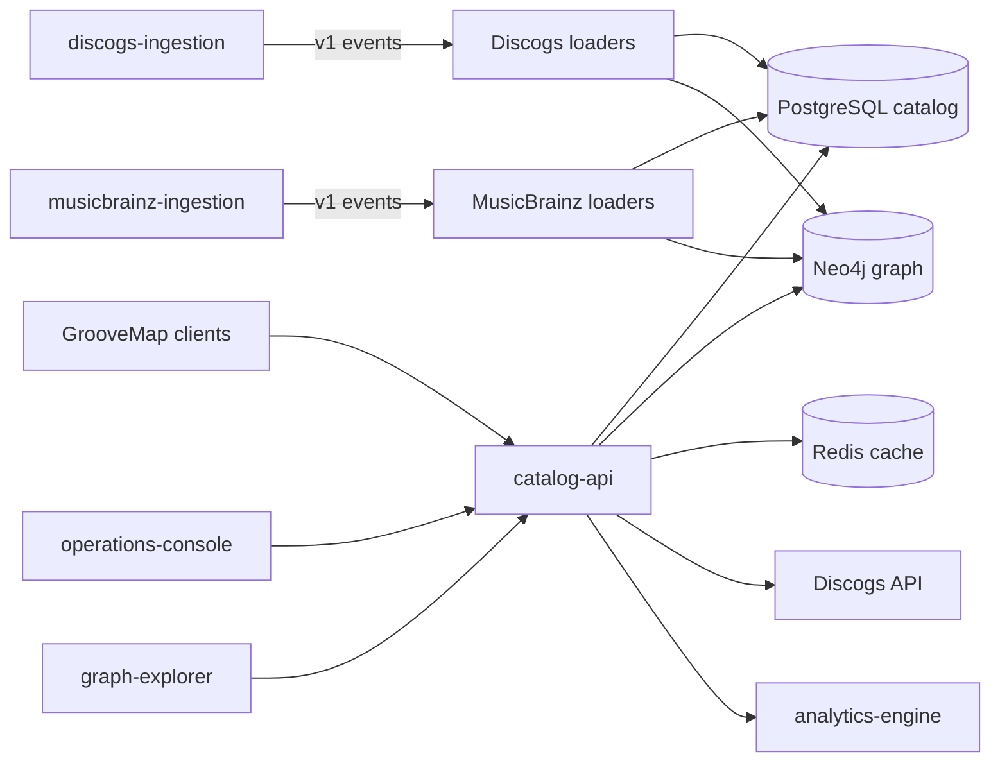

# GrooveMap catalog API

Owns GrooveMap authentication, Discogs OAuth and synchronization, catalog search, graph
queries, recommendations, natural-language queries, internal analytics endpoints, and
operator setup CLIs.



## Development

**Public-library cutover: complete.** This service consumes `groovemap-runtime` and
`groovemap-agent-tools` from the public `groovemap-music/python-libraries` repository at the
reviewed revision recorded in the lockfile. Local setup and CI do not require private-package
credentials.

```bash
mise install
just setup
just check
just image
```

`just check` is the authoritative pre-merge gate. It uses fakes and mocks for external
systems. Live integration, load, and deployment checks are deliberately separate. The
performance runner is owned here, while deployment owns its environment and orchestration.
Use `just --summary` to list the complete recipe surface. `just format-check`, `just lint`,
`just contract-check`, `just test`, and `just coverage` provide focused feedback;
`just secret-scan` and `just audit` are separate policy capabilities. `just image`,
`just performance-image`, and `just release-dry-run` build or rehearse locally and never
publish.

`just test-integration` starts disposable PostgreSQL and Neo4j containers on random
loopback ports, runs the engine-backed query and collection-write regressions, and removes
both containers on exit. It requires a running Docker engine and never targets configured
development or production databases. The suite covers the historical credits-query grouping
failure, collection-upsert preservation, query-helper result handling, invalid Cypher, and a
real server-side query timeout. Pull-request CI supplies this command as the repository's
separate integration lane; `just check` remains network-free.

Pull requests, pushes to `main`, the weekly schedule, and Dependabot pull requests all use
the same required validation graph from the public `groovemap-music/automation` repository.
The public Python-library source is pinned at an immutable revision and requires no GitHub App
credential. A cross-repository PAT and a reduced dependency-update gate are both rejected.

## Observability

The service pushes OpenTelemetry metrics and traces over OTLP HTTP/protobuf and never
exposes a Prometheus scrape endpoint of its own. It reads only the standard OpenTelemetry
environment variables; with `OTEL_EXPORTER_OTLP_ENDPOINT` unset it installs a no-op meter
provider and a no-op tracer provider and behaves exactly as it did before.

Alongside the HTTP, database, cache, sync, and NLQ metrics it records, the service reports
the process view and event-loop lag that `groovemap-runtime` installs, and it opens two
domain root spans of its own: `api.sync` for a Discogs collection and wantlist sync, and
`api.nlq` for a natural-language query. Request, outbound-HTTP, and database spans come from
the instrumentations and the shared resilient wrappers. The
[configuration guide](docs/configuration.md#opentelemetry-metrics-and-traces) lists the
variables, the metrics, and the spans.

## Contracts

- Catalog events are promoted independently from
  [`discogs-ingestion`](https://github.com/groovemap-music/discogs-ingestion) and
  [`musicbrainz-ingestion`](https://github.com/groovemap-music/musicbrainz-ingestion) and
  verified by digest.
- Persistence compatibility is promoted from `database-schema` and pins the tested runtime.
- The internal Analytics OpenAPI document and generated consumer binding are owned in
  `api/contracts/internal-insights/v1/`; downstream consumers promote the artifact rather
  than this repository writing across a boundary.

## Release and license

This repository versions one service wheel and container image. Commitizen reads the PEP
621 version and uses annotated `v$version` tags. `just release-dry-run` creates local
checksums, an SBOM, notices, and provenance without tagging, pushing, publishing, or
releasing.

The current tree is licensed under the [GNU Affero General Public License v3 only](LICENSE).
The AGPL permits commercial use when its terms are followed; commercial use by itself does
not require a separate license. Copyright holders may negotiate optional alternative terms
with parties that do not want to use the software under the AGPL; see
[commercial licensing](COMMERCIAL-LICENSING.md). [NOTICE](NOTICE) records prior-license
history.

The container build injects its full Git revision into the service. The generated
`/openapi.json`, `/docs`, and `/redoc` metadata link to the corresponding source tree
for that exact revision.

External code and documentation contributions are paused until the project adopts a
relicensing-capable contributor license agreement. See [CONTRIBUTING.md](CONTRIBUTING.md).

## Documentation

See the [documentation index](docs/README.md) for configuration, administration,
performance, examples, architecture decisions, and release-compliance gates.
