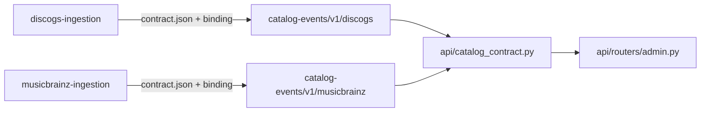

# Contracts

`catalog-api` consumes two upstream contracts. Both are promoted from a reviewed,
immutable commit of the owning repository rather than edited here; `scripts/check-
contracts.py` (`just source-check`) digest-verifies every promoted file against its
`source.json` record.

## `persistence/v1`

`database-schema` owns Neo4j and PostgreSQL compatibility. `compatibility.json` is
promoted byte-for-byte from `database-schema`; `source.json` records the producer commit
and the file's SHA-256 digest. `compatibility.json`'s `application_runtime.tested_commit`
must equal the `groovemap-runtime` / `groovemap-agent-tools` revision pinned in
`pyproject.toml`'s `[tool.uv.sources]` -- the check script asserts the two match.

## `catalog-events/v1`

`groovemap.catalog-events/v1` is **not** owned by a single repository. Per [ADR 0005,
"Source-owned catalog ingestion
repositories"](https://github.com/groovemap-music/design/blob/main/docs/adr/0005-source-owned-catalog-ingestion.md),
the combined `catalog-ingestion` producer was split so that Discogs and MusicBrainz each
own their acquisition, contract, and release independently:

`catalog-api` **composes** the contract from both source-owned producers (it purges
dead-letter queues for all four registered consumers -- `graphinator` / `tableinator` for
Discogs, `brainzgraphinator` / `brainztableinator` for MusicBrainz -- from one admin
router), so each producer is promoted into its own subdirectory:

- `catalog-events/v1/discogs/contract.json` and `catalog-events/v1/discogs/python/
  catalog_contract.py`, promoted byte-for-byte from `discogs-ingestion`, with
  `catalog-events/v1/discogs/source.json` naming the producer repository, commit, and
  both files' digests.
- `catalog-events/v1/musicbrainz/contract.json` and `catalog-events/v1/musicbrainz/
  python/catalog_contract.py`, promoted the same way from `musicbrainz-ingestion`.

Each promoted `contract.json` carries its own `runtime_identifiers` block -- the exact
exchange, queue, dead-letter-exchange, and dead-letter-queue names that source's
consumers already have durable state under. ADR 0005 freezes these: a promotion must
never rename an identifier a consumer already has messages under.

Neither promoted `python/catalog_contract.py` is imported at runtime -- each split
binding exposes only `exchange_name(entity)` and `queue_name(consumer, entity)` for its
own source, with no dead-letter helpers, and `contracts/` is not copied into the
container image (see `Dockerfile`). `api/catalog_contract.py` is instead a hand-authored
composed adapter: it re-exports both sources' entity vocabulary and exchange prefixes
under one import and reconstructs `dead_letter_exchange_name` / `dead_letter_queue_name`
with the `.dlx` / `.dlq` templates the promoted contracts' `queue` sections define.
`tests/test_catalog_contract_frozen_identifiers.py` snapshots every name the adapter
produces against both promoted contracts' `runtime_identifiers` blocks, so a future
promotion that silently shifts a name is caught immediately.

### Promoting a new producer commit

1. Pick the reviewed commit in the producer repository and confirm its `contract.json`
   and generated Python binding.
2. Copy both files byte-for-byte into the matching `catalog-events/v1/<source>/`
   subdirectory.
3. Update that subdirectory's `source.json` with the new commit and both files' SHA-256
   digests.
4. If entity vocabulary, exchange prefixes, consumers, or templates changed, update
   `api/catalog_contract.py` to match and re-run
   `tests/test_catalog_contract_frozen_identifiers.py` -- a diff there is a durable AMQP
   identifier moving and must be treated as a breaking, coordinated rollout, not a
   routine promotion.
5. Run `just source-check` (or at least `python scripts/check-contracts.py`) to confirm
   every promoted file and its `source.json` agree.

Never write an absolute host path into any `source.json` or other tracked file -- only
the commit sha, the repository-relative path, and the digest.
