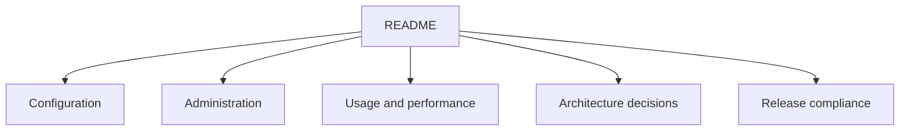

# Catalog API documentation

These guides cover only the `catalog-api` repository boundary. Deployment topology,
infrastructure credentials, and cross-service orchestration are owned by their respective
GrooveMap repositories.

- [Configuration](configuration.md)
- [Administration](admin-guide.md)
- [Usage examples](usage-examples.md)
- [Logging](logging-guide.md)
- [Log emoji conventions](emoji-guide.md)
- [Database resilience](database-resilience.md)
- [Performance](performance-guide.md)
- [Query performance optimizations](query-performance-optimizations.md)
- [Transactional email decision](transactional-email-provider-decision.md)
- [Architecture decisions](architecture-decisions.md)
- [Release compliance](release-compliance.md)
- [History rewrite approval gate](history-rewrite-gate.md)
