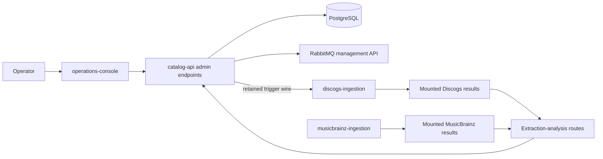

# catalog-api administration

This guide documents the administrative API and command-line tools owned by `catalog-api`.
The operator UI is owned by
[`operations-console`](https://github.com/groovemap-music/operations-console), while container
execution and production topology are owned by
[`deployment`](https://github.com/groovemap-music/deployment).



## Bootstrap an administrator

The packaged `admin-setup` command creates, lists, or updates administrators in PostgreSQL.
It never accepts a password as a command-line argument. Interactive use prompts without echo;
automation must supply `ADMIN_PASSWORD` or `ADMIN_PASSWORD_FILE`.

```bash
admin-setup --email admin@example.com
admin-setup --list
```

Passwords must contain at least eight characters. Running the create command for an existing
email updates its password. The exact container invocation belongs in the deployment runbook.

## Authentication and audit

All administrative endpoints except login require an administrator bearer token.

| Method | Path | Responsibility |
| --- | --- | --- |
| `POST` | `/api/admin/auth/login` | Create an administrator session |
| `POST` | `/api/admin/auth/logout` | Revoke the current session |
| `GET` | `/api/admin/audit-log` | Read the paginated 90-day audit window |
| `GET` | `/api/admin/users/stats` | Aggregate account statistics |
| `GET` | `/api/admin/users/sync-activity` | Recent user synchronization activity |
| `GET` | `/api/admin/storage` | Catalog storage summaries |

Authentication failures do not log email addresses or secrets. Administrative mutations append
an audit entry with the actor, action, target, and non-secret details.

## Extraction control and analysis

`POST /api/admin/extractions/trigger` records a pending run, calls the configured
`EXTRACTOR_HOST` trigger, and tracks progress through its health contract. That retained wire
targets [`discogs-ingestion`](https://github.com/groovemap-music/discogs-ingestion). The
independent [`musicbrainz-ingestion`](https://github.com/groovemap-music/musicbrainz-ingestion)
producer has no Catalog API trigger or scheduling dependency. Each producer owns its extraction
implementation and release schedule; Catalog API owns only the authenticated Discogs trigger,
progress record, local result analysis, and failure translation exposed to clients.

| Method | Path | Responsibility |
| --- | --- | --- |
| `POST` | `/api/admin/extractions/trigger` | Request a forced ingestion run |
| `GET` | `/api/admin/extractions` | List tracked runs |
| `GET` | `/api/admin/extractions/{extraction_id}` | Read one tracked run |
| `GET` | `/api/admin/extraction-analysis/versions` | List locally visible result versions |
| `GET` | `/api/admin/extraction-analysis/{version}/summary` | Summarize validation results |
| `GET` | `/api/admin/extraction-analysis/{version}/violations` | Page through violations |
| `GET` | `/api/admin/extraction-analysis/{version}/violations/{record_id}` | Read one violation record |
| `GET` | `/api/admin/extraction-analysis/{version}/skipped` | Page through skipped records |
| `GET` | `/api/admin/extraction-analysis/{version}/parsing-errors` | Page through parsing errors |
| `GET` | `/api/admin/extraction-analysis/{version}/compare/{other_version}` | Compare two result versions |
| `POST` | `/api/admin/extraction-analysis/{version}/prompt-context` | Build bounded rule context |
| `POST` | `/api/admin/extraction-analysis/{version}/generate-ai-prompt` | Generate a bounded prompt from selected rules |

Mounted extraction result paths are a deployment choice. The API bounds file reads, validates
version and record identifiers, and caches expensive local scans for five minutes. Prompt
requests use `PromptContextRequest`: `rules` contains between 1 and 20 `{rule, entity_type}`
selections, and the API returns bounded, truncated sample context. The route identifiers consumed
by operations-console are pinned in
[`api/contracts/operations-console/v1/routes.json`](../api/contracts/operations-console/v1/routes.json).

## Media mapping coverage

| Method | Path | Responsibility |
| --- | --- | --- |
| `GET` | `/api/admin/media/unmapped` | Report bounded unmapped-media coverage for one provider |

The route accepts `provider=discogs|musicbrainz` and `limit=1..100` and returns the current
`UnmappedMediaResponse`: tagged-release count, releases with unmapped names, a bounded rate, and
the top unmapped format or description names. It reads provider-owned loaded data; it does not
alter either producer's taxonomy or source records.

## Dead-letter queue purge

`POST /api/admin/dlq/purge/{queue}` purges one queue only when its name is generated by the
versioned catalog-event contract. A purge is permanent and creates an audit entry. The API owns
the allowlist and RabbitMQ management call; processing behavior belongs to the consumers:

- [`discogs-graph-enricher`](https://github.com/groovemap-music/discogs-graph-enricher)
- [`discogs-sql-loader`](https://github.com/groovemap-music/discogs-sql-loader)
- [`musicbrainz-graph-enricher`](https://github.com/groovemap-music/musicbrainz-graph-enricher)
- [`musicbrainz-sql-loader`](https://github.com/groovemap-music/musicbrainz-sql-loader)

Operators should diagnose and correct the consumer failure before purging. Replay and queue
recovery procedures belong to the relevant consumer and deployment runbooks.

## Metrics history

The catalog API samples request latency, queue depth, and configured health endpoints, then stores
history in PostgreSQL. Collection failures return an empty sample rather than terminating the API.

| Method | Path | Responsibility |
| --- | --- | --- |
| `GET` | `/api/admin/queues/history` | Queue depth and rate history |
| `GET` | `/api/admin/health/history` | Health and response-time history |

Both history routes accept `range`; supported values are `1h`, `6h`, `24h`, `7d`, `30d`, `90d`,
and `365d`.
`METRICS_COLLECTION_INTERVAL` defaults to 300 seconds and `METRICS_RETENTION_DAYS` defaults to
366 days. The presentation of these records belongs to `operations-console`.

The metrics and audit table definitions are owned by
[`database-schema`](https://github.com/groovemap-music/database-schema). Apply schema changes
through that repository before deploying catalog-api code that depends on them.
