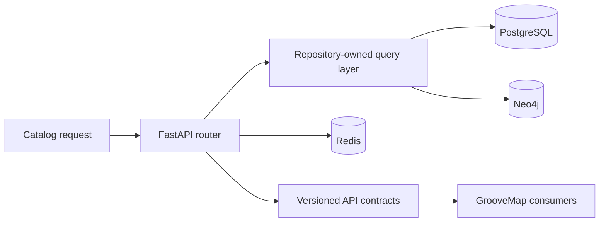

# Catalog API architecture decisions

This record preserves the reusable conclusions from implementation planning without carrying
task transcripts, internal execution prompts, or private planning paths into the public
repository surface.

## Accepted decisions

- Keep authentication, catalog search, graph exploration, recommendation, NLQ, analytics
  computation, and operator endpoints together because they share one identity and persistence
  boundary. Consumers use versioned HTTP contracts rather than source imports.
- Keep database retry, TLS, and query instrumentation in `groovemap-runtime`; this repository
  pins the tested runtime revision and owns query behavior, bounds, and API error mapping.
- Bound expensive graph and enrichment work at the API edge. Pagination, maximum path depth,
  batch size, and timeout classification are contract behavior and have regression coverage.
- Keep NLQ data access behind typed tools. Streaming and non-streaming responses expose the same
  result keys, and interrupted streams cancel their engine work.
- Keep release rarity and community enrichment as internal authenticated API operations. The
  analytics scheduler calls the contract; it does not import catalog implementation modules.
- Keep password reset and optional TOTP inside the catalog identity boundary. Transactional mail
  uses the notification-channel interface and sends through Resend over HTTP without a vendor SDK.
- Build the performance runner as the repository-named `catalog-api-performance` image. Runtime
  deployment and environment orchestration remain outside this repository.

## Superseded planning material

Detailed planning transcripts under `docs/superpowers/` are not part of the intended public
documentation contract. Their useful conclusions are represented here and in the focused guides
linked from the documentation index. Removing those paths from every historical object requires
the separately approved procedure in [the history rewrite gate](history-rewrite-gate.md).
