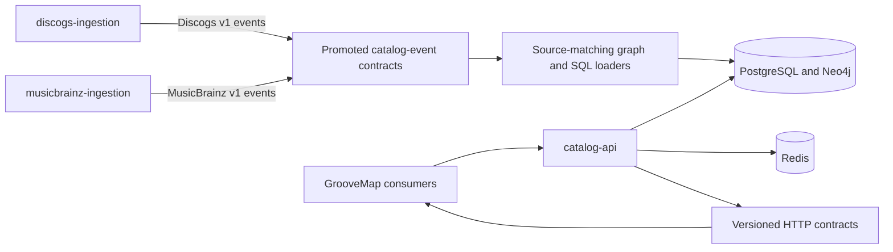

# Catalog API architecture decisions

This record preserves the reusable conclusions from implementation planning without carrying
task transcripts, internal execution prompts, or private planning paths into the public
repository surface.

## Accepted decisions

- Keep authentication, catalog search, graph exploration, recommendation, NLQ, analytics
  computation, and operator endpoints together because they share one identity and persistence
  boundary. Consumers use versioned HTTP contracts rather than source imports.
- Follow [ADR 0005](https://github.com/groovemap-music/design/blob/main/docs/adr/0005-source-owned-catalog-ingestion.md):
  `discogs-ingestion` and `musicbrainz-ingestion` independently own their source acquisition,
  event contracts, images, releases, and schedules. Catalog API promotes both v1 contracts and
  does not coordinate the producers. Its retained `EXTRACTOR_HOST` administrative trigger is the
  Discogs compatibility endpoint, not a combined ingestion service.
- Keep application construction side-effect free. FastAPI lifespan owns configuration and
  adapter creation, router wiring, background tasks, and reverse-order shutdown; routers depend
  on the configured capabilities while public module and route entry points stay stable.
- Keep database retry, TLS, and query instrumentation in `groovemap-runtime`; this repository
  pins the tested runtime revision and owns query behavior, bounds, and API error mapping.
- Bound expensive graph and enrichment work at the API edge. Pagination, maximum path depth,
  batch size, and timeout classification are contract behavior and have regression coverage.
- Keep NLQ data access behind typed tools. Streaming and non-streaming responses expose the same
  result keys, and interrupted streams cancel their engine work.
- Keep release rarity and community enrichment as internal authenticated API operations. The
  analytics scheduler calls the contract; it does not import catalog implementation modules.
- Keep password reset and optional TOTP inside the catalog identity boundary. Transactional mail
  uses the notification-channel interface and sends through Resend over HTTP without a vendor SDK.
- Build the performance runner as the repository-named `catalog-api-performance` image. Runtime
  deployment and environment orchestration remain outside this repository.
- Follow [ADR 0009](https://github.com/groovemap-music/design/blob/main/docs/adr/0009-native-identity-and-provider-aliases.md):
  key every catalog entity by a native id that `provider_aliases` maps a provider's id onto;
  mint only on the write side (the Discogs sync), never from a read path. See
  [Native identity and first-party activity](identity-and-activity.md).
- Follow [ADR 0010](https://github.com/groovemap-music/design/blob/main/docs/adr/0010-first-party-events-consent-and-deletion.md):
  record first-party behavioural events and recommendation impressions in process, pseudonymised
  by subject, against the closed published vocabulary; consent, erasure, and export are this
  repository's endpoints over that same record. See
  [Native identity and first-party activity](identity-and-activity.md).
- Follow [ADR 0011](https://github.com/groovemap-music/design/blob/main/docs/adr/0011-catalog-identifiers-and-manufacturing-credits.md):
  serve catalogue identifiers, manufacturing credits, and release country from the blocks the
  loaders write, and resolve a barcode, catalogue number, or matrix inscription through
  `provider_aliases` rather than through search. The reader normalizes an identifier with the
  same vendored vocabulary the writer minted it from. See
  [Catalogue identifiers, credits, and country](catalog-identifiers.md).

- Follow ADR 0012 (Neo4j → PostgreSQL 19 property graph migration): introduce `GRAPH_BACKEND`
  and a per-query-family backend selector as the seam later phases plug into, then migrate the
  graph reads one family at a time. The collaborators family is the first one migrated: with
  `GRAPH_BACKEND=postgres` it is answered by SQL/PGQ `GRAPH_TABLE` queries over the
  `graph.catalog` property graph instead of Cypher, and row-level parity with the Neo4j
  implementation is proved against a PostgreSQL 19 container. Its query is the worked example
  the remaining families are migrated from — see
  [The GRAPH_TABLE migration template](graph-table-migration-template.md) and
  [Configuration](configuration.md#connections-and-pools).

Historical references to the combined `catalog-ingestion` repository describe the pre-split
lineage retained by ADR 0005. They are migration records, not the name of a current producer or
an active ownership boundary.

## Superseded planning material

Detailed planning transcripts under `docs/superpowers/` are not part of the intended public
documentation contract. Their useful conclusions are represented here and in the focused guides
linked from the documentation index. Removing those paths from every historical object requires
the separately approved procedure in [the history rewrite gate](history-rewrite-gate.md).
