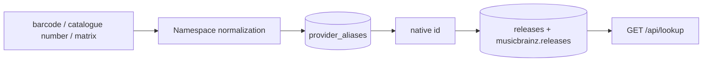

# Catalogue identifiers, credits, and country

[ADR 0011](https://github.com/groovemap-music/design/blob/main/docs/adr/0011-catalog-identifiers-and-manufacturing-credits.md)
gave every release three facts the catalogs always held and nothing downstream ever read:
the catalogue identifiers printed on the object, the companies that manufactured it, and
the country it was issued in. `catalog-api` serves all three.



## `GET /api/lookup/{provider}/{value}`

The gesture this serves is the one a collector performs in a shop: they have the record in
their hands, and the only thing they can type is a number printed on it.

`provider` is one of three alias namespaces — `barcode`, `catalog_number`, and `matrix`.
These are exactly the namespaces ADR 0011 mints `provider_aliases` rows into. A namespace
that mints nothing (`label_code`, `rights_society`, `asin`) is rejected with `400` rather
than answered with an empty result, so a caller learns the provider is not a lookup
namespace instead of concluding their record is absent.

The value is normalized with that namespace's declared rule before it is looked up, so a
barcode typed with its grouping spaces and one typed without resolve to the same row:

| Provider | Normalization | `5 012394 144777` → |
| --- | --- | --- |
| `barcode` | digits only | `5012394144777` |
| `catalog_number` | upper-cased, whitespace collapsed | `PB 41447` |
| `matrix` | whitespace collapsed, case preserved | `PB 41447-A2 UTOPIA MS` |

Matrix inscriptions keep their case because the characters stamped into the run-out groove
are the evidence. The normalization is applied through `common.identifiers`, the same
vendored vocabulary the loaders minted the rows from, so the reader can never normalize a
value differently from the writer.

The endpoint is public and rate limited to 30 requests a minute, exactly like search: a
person holding a record in one hand cannot sign in. For a caller who *is* signed in, the
lookup is recorded as a `search.query` event filtered by `lookup:<provider>`, a hit and a
miss alike.

```bash
# Resolve a barcode, spaces and all
curl "http://localhost:8004/api/lookup/barcode/5%20012394%20144777"

# A catalogue number, in whatever case it was typed
curl "http://localhost:8004/api/lookup/catalog_number/pb%2041447"

# A run-out inscription (percent-encode any slash in the value)
curl "http://localhost:8004/api/lookup/matrix/PB%2041447-A2%20UTOPIA%20MS"
```

```json
{
  "provider": "barcode",
  "value": "5 012394 144777",
  "normalized": "5012394144777",
  "gm_id": "0199…",
  "releases": [
    {"id": "249504", "source": "discogs", "title": "Never Gonna Give You Up",
     "artist": "Rick Astley", "year": 1987, "media_families": ["vinyl"]},
    {"id": "f4b7b1a0-…", "source": "musicbrainz", "title": "Never Gonna Give You Up",
     "artist": null, "year": 1987, "media_families": ["vinyl"]}
  ]
}
```

`releases` can carry rows from both catalogs, because one barcode is one pressing and both
catalogs describe it; `source` names which catalog each row came from. MusicBrainz releases
carry no artist credit through the ingestion whitelist, so `artist` is null there rather
than guessed at.

A value no valid alias carries is `404`. So is a value whose alias points at no loaded
release row: a lookup that cannot show the caller a record found nothing, and reporting an
internal loading state as a fact about their record would be worse than saying so.

## The `country` facet on search

`GET /api/search` accepts a repeatable `country` parameter. It narrows the releases branch
of the search against `releases.data->>'country'`, which is already indexed; the artist,
label, and master branches are unaffected, exactly like the genre and media facets. Several
values OR-combine, and the facet AND-combines with every other filter.

Countries are matched **exactly as the catalog stores them**. Discogs writes country names
(`UK`, `Germany`) and MusicBrainz writes ISO codes; neither is a closed vocabulary this
service owns, so an unrecognised value is a filter that matches nothing rather than a
`400`, and nothing is folded into an equivalence the catalog never asserted.

Every search hit now carries `country` beside `gm_id`. It is `null` for every entity type
but a release, and for a release the catalog gave no country for.

```bash
# Releases issued in the UK
curl "http://localhost:8004/api/search?q=blue&types=release&country=UK&limit=20"

# Either of two countries
curl "http://localhost:8004/api/search?q=blue&types=release&country=UK&country=Germany"
```

## `identifiers`, `companies`, and `country` on release detail

`GET /api/node/{node_id}?type=release` gains three additive fields, read from the release's
`data` JSONB in PostgreSQL alongside the ADR 0007 `media` block:

- `identifiers` — the catalogue markings, in the source order the producer published them:
  barcodes, matrix and run-out inscriptions, label codes, rights societies, ASINs, and the
  catalogue number lifted from the release's label entries. Each entry carries its canonical
  `type`, its `value` as received, and the free-text `description` beside it.
- `companies` — the manufacturing and rights credits: the pressing plant, the lacquer
  cutting room, the mastering house, the distributor, the copyright holders. Each entry
  carries the raw provider `role` and the canonical `role_category` it maps onto.
- `country` — the country string the catalog stored, or `null`.

The credits are read from the block rather than from the Neo4j `CREDITED_TO` edges the
graph enricher writes. The edges are a projection of this same block, so reading the block
is one indexed row rather than a traversal, and the two cannot disagree.

All three keys are always present on a release response. A release whose catalogue markings
nobody published gets two empty lists and a null country, so a consumer renders "no
markings recorded" rather than branching on whether the field exists.

## Two things named after a catalogue number

`Release.catalog_number` in Neo4j is written by this service's live per-user Discogs
synchronisation, from the catalogue number *that user's collection row* carried. It is a
per-collection assertion about one person's copy.

The `catalog_number` entries in the identifiers block, and the `catalog_number` aliases they
mint, are what the *catalog* says about the release. ADR 0011 deliberately does not
reconcile the two and neither overwrites the other. A consumer that treats them as
interchangeable will be wrong about whose assertion it is reading.

## Consumer contracts

The lookup route and the search `country` parameter are published additively in the
`graph-explorer` and `mcp-server` route registries under their existing version 1. A
registry entry may now carry a `parameters` list beside its method and path; the contract
tests assert every named parameter is still accepted by the served OpenAPI document, so a
query parameter a consumer builds on cannot be removed silently.
