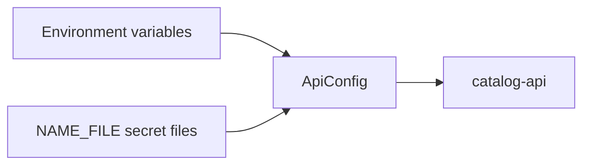

# catalog-api configuration

This reference covers only configuration read by the `catalog-api` repository. The
[`deployment` repository](https://github.com/groovemap-music/deployment) owns Compose wiring,
production secret creation, service discovery, and cross-service defaults.



## Required settings

The API fails fast when any required value is missing.

| Variable | Purpose |
| --- | --- |
| `POSTGRES_HOST` | PostgreSQL host or `host:port` |
| `POSTGRES_USERNAME` | PostgreSQL login |
| `POSTGRES_PASSWORD` | PostgreSQL password |
| `POSTGRES_DATABASE` | PostgreSQL database |
| `JWT_SECRET_KEY` | HS256 signing secret; use at least 32 random bytes |
| `NEO4J_HOST` | Neo4j host or full Bolt URI |
| `NEO4J_USERNAME` | Neo4j login |
| `NEO4J_PASSWORD` | Neo4j password |

Every secret read through the shared runtime also accepts a file path named `<NAME>_FILE`.
For example, set `POSTGRES_PASSWORD_FILE=/run/secrets/postgres_password` instead of putting the
password in the environment. Do not set both forms to conflicting values.

## Connections and pools

| Variable | Default | Purpose |
| --- | --- | --- |
| `POSTGRES_PORT` | `5432` | PostgreSQL port when it is not embedded in `POSTGRES_HOST` |
| `POSTGRES_POOL_MIN_SIZE` | `2` | Minimum API pool size |
| `POSTGRES_POOL_MAX_SIZE` | `8` | Maximum API pool size |
| `NEO4J_TLS_ENABLED` | `false` | Enable Bolt TLS for a host without a TLS URI scheme |
| `NEO4J_TLS_VERIFY` | `true` | Verify the Bolt certificate when TLS is enabled |
| `REDIS_HOST` | `redis://redis:6379/0` | Redis host or URL |
| `REDIS_PASSWORD` | unset | Optional Redis password; `REDIS_PASSWORD_FILE` is supported |

Use `neo4j+s://...` in `NEO4J_HOST` for a managed Neo4j endpoint that already expresses its
TLS policy. Deployment-specific certificate and network guidance belongs in `deployment`.

## Authentication and public URLs

| Variable | Default | Purpose |
| --- | --- | --- |
| `JWT_ALGORITHM` | `HS256` | Only `HS256` is accepted |
| `JWT_EXPIRE_MINUTES` | `30` | Access-token lifetime |
| `DISCOGS_USER_AGENT` | `GrooveMap-catalog-api/1.0 +https://github.com/groovemap-music/catalog-api` | Discogs request identity |
| `DISCOGS_OAUTH_CALLBACK_URL` | unset | Registered public Discogs callback; unset retains the OOB flow |
| `APP_BASE_URL` | `http://localhost:8006` | Public browser origin used in email links |
| `CORS_ORIGINS` | unset | Comma-separated allowed origins; unset disables CORS |
| `ENCRYPTION_MASTER_KEY` | unset | HKDF input for OAuth and TOTP encryption |

`APP_BASE_URL` is a user-facing origin, not an internal API address. Set it to the real HTTPS
origin in production so password-reset links do not point at localhost.

## Repository integrations

| Variable | Default | Purpose |
| --- | --- | --- |
| `INSIGHTS_INTERNAL_SECRET` | unset | Shared secret for the internal Analytics router; unset fails closed |
| `RESEND_API_KEY` | unset | Optional transactional-email API key |
| `RESEND_SENDER_EMAIL` | `noreply@groovemap.music` | Transactional-email sender |
| `RESEND_SENDER_NAME` | `GrooveMap` | Transactional-email display name |
| `EXTRACTOR_HOST` | `extractor-discogs` | Ingestion health endpoint host; retained compatibility wire ID |
| `EXTRACTOR_HEALTH_PORT` | `8000` | Extraction health endpoint port |
| `RABBITMQ_MANAGEMENT_HOST` | `RABBITMQ_HOST` or `rabbitmq` | RabbitMQ management endpoint host |
| `RABBITMQ_MANAGEMENT_PORT` | `15672` | RabbitMQ management endpoint port |
| `RABBITMQ_USERNAME` | `groovemap` | RabbitMQ management login |
| `RABBITMQ_PASSWORD` | `groovemap` | RabbitMQ management password |
| `METRICS_RETENTION_DAYS` | `366` | API metrics retention window |
| `METRICS_COLLECTION_INTERVAL` | `300` | Metrics collection interval in seconds |

The internal Analytics secret and RabbitMQ credentials support their corresponding `_FILE`
forms. Ingestion runtime behavior belongs to
[`catalog-ingestion`](https://github.com/groovemap-music/catalog-ingestion); the compatibility
hostname remains part of the deployed wire contract.

## Snapshots, NLQ, and runtime

| Variable | Default | Purpose |
| --- | --- | --- |
| `SNAPSHOT_TTL_DAYS` | `28` | Snapshot lifetime |
| `SNAPSHOT_MAX_NODES` | `100` | Maximum nodes per snapshot |
| `SNAPSHOT_MAX_PAYLOAD_BYTES` | `65536` | Maximum serialized snapshot size |
| `SNAPSHOT_MAX_PER_USER` | `50` | Maximum retained snapshots per user |
| `NLQ_ENABLED` | `false` | Enable natural-language queries |
| `NLQ_API_KEY` | unset | Provider key; `NLQ_API_KEY_FILE` is supported |
| `NLQ_MODEL` | `claude-sonnet-4-20250514` | Provider model identifier |
| `NLQ_MAX_ITERATIONS` | `5` | Tool-loop limit |
| `NLQ_MAX_QUERY_LENGTH` | `500` | Input length limit |
| `NLQ_CACHE_TTL` | `3600` | NLQ cache lifetime in seconds |
| `NLQ_RATE_LIMIT` | `10/minute` | Per-client rate limit |
| `LOG_LEVEL` | `INFO` | API and server log level |
| `FORWARDED_ALLOW_IPS` | `172.20.0.0/16` | Trusted proxy addresses for Uvicorn |
| `GROOVEMAP_SOURCE_REVISION` | build revision | Exact source revision linked from OpenAPI metadata |

See the [logging guide](logging-guide.md) for the API's logging behavior.

## OpenTelemetry metrics

The API pushes metrics over OTLP HTTP/protobuf and exposes no Prometheus scrape endpoint of
its own. Only the standard OpenTelemetry variables are read, all of them by the SDK inside
`groovemap-runtime`; there is no GrooveMap-specific telemetry variable. With
`OTEL_EXPORTER_OTLP_ENDPOINT` unset the service installs a no-op meter provider and runs
exactly as it did before, so telemetry can never fail startup or change behavior.

| Variable | Default | Purpose |
| --- | --- | --- |
| `OTEL_EXPORTER_OTLP_ENDPOINT` | unset | Collector base URL, for example `http://otel-collector:4318`; unset disables export |
| `OTEL_EXPORTER_OTLP_METRICS_ENDPOINT` | falls back to the base URL | Metrics-only endpoint override |
| `OTEL_METRICS_EXPORTER` | `otlp` | `none` forces export off |
| `OTEL_SDK_DISABLED` | `false` | `true` makes the SDK itself a no-op |
| `OTEL_METRIC_EXPORT_INTERVAL` | `15000` in deployment | Push interval in milliseconds |
| `OTEL_SERVICE_NAME` | `api` | `service.name`; the compose service key |
| `OTEL_RESOURCE_ATTRIBUTES` | unset | Extra resource attributes, for example `service.namespace=groovemap,deployment.environment.name=dev` |

The API records these metrics. `service.version` is the packaged version, and no attribute
ever carries an identifier, a cache key, or free text.

| Metric | Attributes |
| --- | --- |
| `http.server.request.duration` | `http.request.method`, `http.route` (the templated path), `http.response.status_code`; `/health` is excluded |
| `http.client.request.duration` | `http.request.method`, `server.address`, `http.response.status_code`; covers analytics-engine, Discogs, and Anthropic |
| `db.client.operation.duration` | `db.system.name` (`postgresql`, `neo4j`, or `redis`), `db.operation.name`, `error.type` on failure |
| `groovemap.api.sync.duration` | `outcome` (`completed`, `failed`, `cancelled`) |
| `groovemap.api.cache` | `outcome` (`hit`, `miss`), `cache` (the logical Redis cache) |
| `groovemap.api.nlq.requests` | `outcome` (`success`, `cached`, `error`, `invalid`, `unavailable`) |

PostgreSQL and Neo4j report `db.client.operation.duration` through the `groovemap-runtime`
resilient wrappers. Redis is reached without one, so its client is wrapped at startup and
reports the same metric itself. The collector, Prometheus, Grafana dashboards, and the
canonical metric catalog are owned by the
[`deployment` repository](https://github.com/groovemap-music/deployment).

This is separate from the Postgres-backed endpoint history in `api/metrics_collector.py`
that operations-console reads over `/api/admin/metrics`. That history is unchanged.

## Minimal local example

Use disposable local credentials only; do not commit this file.

```bash
POSTGRES_HOST=localhost
POSTGRES_USERNAME=groovemap
POSTGRES_PASSWORD=local-only
POSTGRES_DATABASE=groovemap
NEO4J_HOST=localhost
NEO4J_USERNAME=neo4j
NEO4J_PASSWORD=local-only
REDIS_HOST=localhost
JWT_SECRET_KEY=replace-with-at-least-32-random-bytes
DISCOGS_USER_AGENT="GrooveMap-catalog-api/1.0 +https://github.com/groovemap-music/catalog-api"
APP_BASE_URL=http://localhost:8006
LOG_LEVEL=INFO
```

The test suite uses fakes and does not require live PostgreSQL, Neo4j, Redis, RabbitMQ, Discogs,
Anthropic, or Resend connections.

## Operator-owned credentials

Discogs application credentials are stored in PostgreSQL rather than environment variables.
Use the packaged `discogs-setup` CLI from the deployed API container; its output masks values.
The [API service guide](../api/README.md#operator-setup) documents that operation.

For runtime secret mounts, container topology, and environment promotion, follow the
[`deployment` documentation](https://github.com/groovemap-music/deployment/tree/main/docs).
