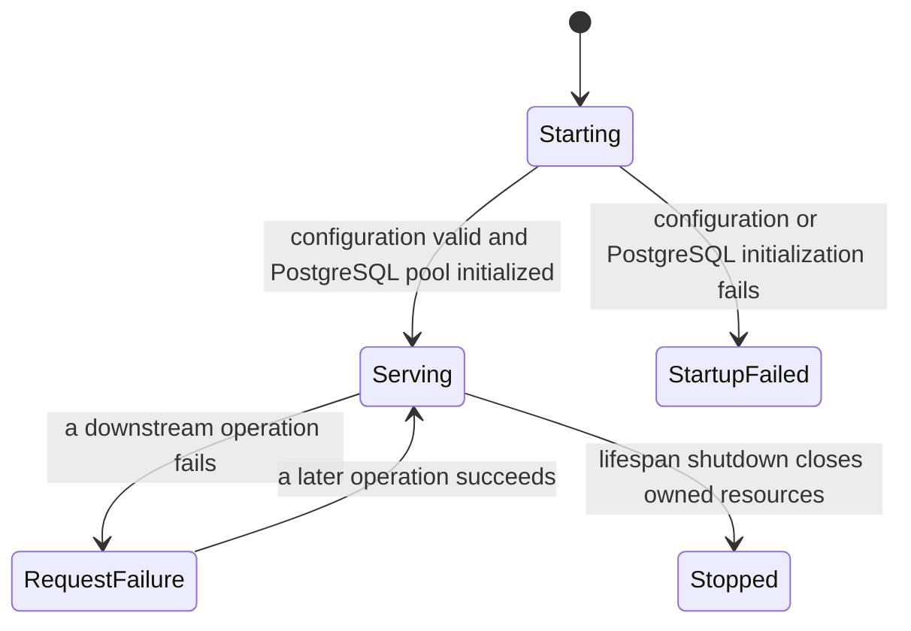

# catalog-api database resilience

This document covers failure behavior implemented by `catalog-api`. Database lifecycle,
maintenance windows, restart procedures, and failure injection belong to
[`deployment`](https://github.com/groovemap-music/deployment).

## Required startup dependencies

The API initializes its PostgreSQL pool and constructs Redis and Neo4j clients during lifespan
startup. Missing required configuration or PostgreSQL initialization failure prevents application
traffic. Redis and Neo4j failures are surfaced when their operations run. Connection construction and retry primitives come
from the pinned shared runtime in
[`python-libraries`](https://github.com/groovemap-music/python-libraries).

- PostgreSQL stores users, tokens, audit records, metrics, and relational catalog data.
- Neo4j serves graph exploration, recommendations, credits, and relationship queries.
- Redis stores short-lived OAuth state, revocations, snapshots, rate limits, and caches.

The authoritative PostgreSQL and Neo4j definitions are owned by
[`database-schema`](https://github.com/groovemap-music/database-schema). `catalog-api` must not
create or mutate infrastructure schema during ordinary startup.

## Request failure behavior

| Dependency | API behavior |
| --- | --- |
| PostgreSQL | Database exceptions become bounded request failures; pooled connections are recycled by the shared runtime |
| Neo4j | Sessions use the resilient driver and explicit per-query timeouts for expensive paths |
| Redis | Cache operations degrade to database work where safe; security state that cannot safely degrade fails closed |
| `analytics-engine` | `/api/insights/*` proxy requests return 503 when the service is unavailable |
| `discogs-ingestion` | The retained administrative trigger/tracker records a terminal failure when its configured endpoint cannot be reached |
| `musicbrainz-ingestion` | Not called by Catalog API; missing or stale loaded data remains visible through ordinary query/analysis results |
| RabbitMQ management API | Queue collection or purge reports the management failure without stopping request serving |

Analytics computation is owned by
[`analytics-engine`](https://github.com/groovemap-music/analytics-engine), and ingestion execution is
owned independently by [`discogs-ingestion`](https://github.com/groovemap-music/discogs-ingestion)
and [`musicbrainz-ingestion`](https://github.com/groovemap-music/musicbrainz-ingestion), as
specified by ADR 0005. This repository owns only its HTTP contracts, the retained Discogs trigger
wire, and error translation; it does not coordinate the two producers.

## Data-loss boundaries

The request metrics buffer uses drain/restore semantics: samples are swapped out before an
awaited write and restored ahead of newer entries if persistence fails. The bounded buffer evicts
oldest entries first when its limit is reached.

User synchronization invalidates caches only after durable writes succeed. OAuth state and JWT
revocation remain TTL-bound in Redis. Authentication and authorization paths must never treat an
unknown dependency result as successful.

## Health and observability

`GET /health` is served on the application and dedicated health ports. It reports the API's own
dependency state; it is not a fleet-level status page. Historical administrative endpoints expose
the samples that catalog-api collected, while visualization and operator workflow belong to
[`operations-console`](https://github.com/groovemap-music/operations-console).

Connection events use the repository [logging conventions](logging-guide.md). They must not
include credentials, connection strings, tokens, or secret-file contents.

## Validation

Default tests use fakes and mocks and must not connect to live PostgreSQL, Neo4j, Redis, RabbitMQ,
Discogs, Anthropic, or Resend services. Test production-like outage and recovery behavior only in
an isolated environment provided by `deployment`.

For schema compatibility, validate the exact promoted `database-schema` image. For graph and SQL
data-production failures, follow the runbooks in the responsible repositories:

- [`discogs-graph-enricher`](https://github.com/groovemap-music/discogs-graph-enricher)
- [`discogs-sql-loader`](https://github.com/groovemap-music/discogs-sql-loader)
- [`musicbrainz-graph-enricher`](https://github.com/groovemap-music/musicbrainz-graph-enricher)
- [`musicbrainz-sql-loader`](https://github.com/groovemap-music/musicbrainz-sql-loader)
