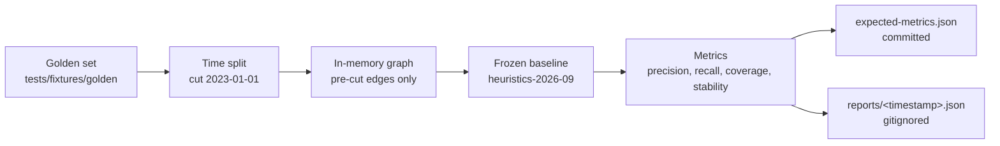

# Offline evaluation harness

Every recommendation and rarity score in `catalog-api` comes out of a heuristic: a handful of
weight tables and threshold functions in `api/queries/recommend_queries.py` and `api/rarity/`.
Those weights were tuned by judgment, and until now nothing recorded what they were or what
they scored. "This change improves recommendations" had no fixed thing to measure against.

The harness in `api/evaluation/` supplies one. It freezes today's weights as a versioned
baseline, scores them against a committed synthetic catalog under a time-split protocol, and
commits the resulting numbers so any change to them shows up as a diff. It runs entirely
offline inside `just check` and never opens a connection to anything.



## Running it

```bash
just evaluate
```

This scores the committed golden set with the frozen baseline, writes the full run to
`reports/<timestamp>.json`, and prints a summary. Nothing else is needed: no database, no
fixture generation step, no network.

`just check` runs the same harness as tests, so a change that moves any number fails the build
rather than landing quietly.

## The golden set

`tests/fixtures/golden/` holds a synthetic catalog, generated by `scripts/generate_golden_set.py`.

| Property | Value |
| --- | --- |
| Releases | 120 |
| Media families | vinyl 40, optical 40, tape 40 |
| Masters | 44, holding one to four sibling pressings each |
| Standalone releases | 12, with no master link |
| Labels | 12, with catalog sizes from 4 to 12,500 |
| Artists | 36 |
| Collectors | 12, holding 15 to 40 releases each |
| Acquisition dates | 2018-01-01 to 2024-12-31 |

Three properties make it usable as a fixture rather than as sample data.

**It is synthetic.** Every artist, label, and title is invented. Nothing here originates from a
provider, and nothing describes a real person's collection, so committing it is safe.

**It is format-balanced.** Each of the three media families holds exactly a third of the
releases. A set that was 90 percent vinyl would let a recommender look good while never
surfacing a cassette, and the per-format metrics below would have nothing to say. Media blocks
are produced through the vendored taxonomy (`common.media.map_discogs_formats`), not written by
hand, so `families_of` resolves them exactly as it does on real data.

**It is deterministic.** The generator draws only from `random.Random.random`, whose sequence
CPython guarantees across versions. The convenience methods (`choice`, `sample`, `shuffle`)
carry no such guarantee, so the generator replaces them with its own helpers. A test
regenerates the set and asserts the bytes are identical to the committed files, which is what
makes the committed JSON a fixture rather than a blob nobody can reproduce.

To change it, edit the generator and run `just generate-golden-set`, then commit the
regenerated JSON and a refreshed metrics snapshot in the same change. Changing the seed
re-rolls every entity.

## The in-memory graph

The scoring functions are pure, but their inputs are Cypher result rows. Calling the functions
offline is not enough to reproduce a baseline: a row shape that is nearly right produces a
number that is confidently wrong.

`api/evaluation/graph.py` answers those shapes from the golden set. Each method mirrors one
query function with the same keys, the same value types, and the same limits and exclusions the
Cypher applies: artist identity and profiles, batch profiles, candidate artists, the three
recommendation candidate signals, collector counts, the explore traversal, the eight core
rarity facts, and the grooved module's sibling-pressing count. The shapes are pinned in
`tests/test_evaluation_graph.py` against examples copied from the tests covering the real
queries, so drift breaks the harness rather than silently rebasing it.

Where Cypher leaves an order unspecified, such as `collect(DISTINCT ...)` or ties inside an
`ORDER BY count`, the adapter picks a deterministic one. An unordered baseline is not a
baseline.

## The baseline and its version rule

`api/evaluation/baseline.py` holds `BASELINE_VERSION` and a frozen copy of every weight table
the scores depend on:

- `_WEIGHTS`, the artist-similarity dimension weights
- `_SIGNAL_WEIGHTS`, the recommendation signal weights
- `CORE_SIGNAL_WEIGHTS`, the media-neutral rarity weights
- the grooved module's `pressing_scarcity` weight
- `MEDIUM_RARITY_SCORES`, the full medium-rarity table

A test asserts the live constants still equal the frozen copies. **Changing a weight is
allowed; changing it silently is not.** Every number in the committed metrics snapshot is
computed from these weights, so a deliberate change means four edits in one commit:

1. update the live weight,
2. update the frozen copy in `baseline.py`,
3. bump `BASELINE_VERSION`,
4. regenerate the snapshot with `uv run python -m api.evaluation.report --update-expected`.

The failing test says exactly this, so the rule is discoverable from the failure rather than
from this page.

`BASELINE_CURRENT_YEAR` is frozen for the same reason. `temporal_scarcity` is measured against
a reference year, and reading it from the clock would drift every score by 1.5 points each
January. Moving it is a baseline change like any other.

## The time-split protocol

Scoring a recommender on a collection it can already see measures memorisation. The split is by
acquisition date, not at random:

- **Observed** — everything a collector added before **2023-01-01**. This is all the baseline
  may see.
- **Held out** — everything added on or after it. Used only to score the ranking.

Every collector in the golden set has at least 8 observed and 5 held-out acquisitions, so the
split is well defined for all of them rather than for the lucky ones.

The cut is enforced by *building the graph* from the pre-cut edges, not by filtering the
results afterwards. A later purchase reaches a ranking through three routes a post-hoc filter
would miss: it can appear as a candidate, it can change a release's obscurity score by
inflating its collector count, and it can change a release's `graph_isolation` score by raising
its node degree. Holding the edges out of the graph closes all three at once.

Wantlists are not split. A want carries no acquisition date, and the golden set only ever draws
a wantlist from releases the collector never acquires, so nothing held out can reach the
baseline through one.

## The metrics

Two averaging conventions are used, and which applies is stated per metric.

- **Macro** averages per-collector values, so a 15-release collector counts as much as a
  40-release one. Used for the headline numbers and the collector-size breakdown.
- **Micro** pools hits across collectors and divides once. Used for the per-format breakdown,
  where a per-collector denominator would be zero whenever a collector held out nothing on
  that format.

| Metric | Meaning |
| --- | --- |
| `precision_at_k` | Share of the top k recommendations the collector later acquired. The denominator is k itself, not the ranking length. |
| `recall_at_k` | Share of the collector's later acquisitions that appear in the top k. |
| `hit_rate` | Share of collectors who got at least one later acquisition into their top 25. |
| `catalogue_coverage` | Share of the catalog recommended to at least one collector. |
| `by_format` | Per family: how much of the ranking it received, how much of the held-out set it represents, and recall@25 against it. |
| `by_collector_size` | The same ranking block, split by observed collection size. |
| `tier_distribution` | Rarity tier counts, overall and per family. |
| `stability.spearman` | Rank correlation between two runs of the same baseline. |

`catalogue_coverage` earns its place because precision alone cannot distinguish a recommender
that scores well by reaching the whole catalog from one that scores the same by showing
everyone the same twenty releases. Those are different products.

`stability.spearman` is 1.0 for a deterministic baseline by construction, which is exactly why
it is reported: anything below 1.0 means the run is not reproducible, and no comparison against
an irreproducible run means anything.

The per-format breakdown exists because the rarity core became media-neutral under ADR 0007. A
single aggregate number would hide a model that had quietly learned to rank only vinyl.

## Where the output goes

| Artifact | Committed? | Why |
| --- | --- | --- |
| `reports/<timestamp>.json` | No, gitignored | Raw run artifacts stay outside the repository, matching the rule in [query performance optimizations](query-performance-optimizations.md). |
| `tests/fixtures/golden/expected-metrics.json` | Yes | Small, diffable, and time-invariant. A fresh run is compared against it at a tolerance of 1e-9. |

The snapshot holds only what two identical runs agree on. The timestamp and the output path are
in the raw report and not in the snapshot, which is what makes the snapshot a regression test
rather than a log. The tolerance is a floating-point allowance, not a noise budget: the harness
is deterministic, so any real difference is a baseline change.

## Registering a second baseline version: the similar-artist candidate scope

`BASELINE_VERSION` ("heuristics-2026-09") stays frozen: it always replays the candidate
generator that was in production before gm-catalog-api-tsmu.1
(`GoldenGraph.candidate_artists`, top 5 genres, 500 candidates per genre, 200 overall, 50
profiled), and its committed `expected-metrics.json` never moves for this change.

gm-catalog-api-tsmu.1 replaced that candidate generator in production
(`api/queries/recommend_queries.py` and `recommend_pg_queries.py`) with a set-based query that
scores every artist sharing at least one genre, style, label, or collaborator signal -- no
per-genre cap. Registering *that* as a baseline change without disturbing the frozen one means
adding a second, narrower version rather than bumping `BASELINE_VERSION` in place:

- `GoldenGraph.candidate_artists_all_signals` mirrors the new production query.
- `run_baseline(graph, similar_artist_candidates="all_signals")` replays it for
  `similar_artists` only -- `recommendations`, `discoveries`, and `rarity` are identical to the
  legacy run, since only the candidate *scope* changed, not any weight -- and reports
  `SIMILAR_ARTIST_CANDIDATES_VERSION` ("similar-artist-all-signals-2026-09").
- `similar_artist_metrics(run, splits, golden)` scores a similar-artist ranking the same way
  `recommendation_metrics` scores a recommendation ranking, adapted to artists: a held-out
  (post-cut) release is a hit at `k` when any artist credited on it appears in the ranking's
  top `k`. This fixture has no independent "who works with whom later" sample the way the
  gm-design-chw.2 spike's dump-wide harness did -- every genre/style/label/artist edge is
  always visible here, and only collector holdings are time-split -- so this is the closest
  analogue the existing split protocol supports.
- `evaluate_similar_artist_candidates()` runs both the new and legacy candidate scopes over
  the same split and scores both, so the comparison is apples to apples. Its snapshot is
  `tests/fixtures/golden/expected-similar-artist-metrics.json`, committed separately from
  `expected-metrics.json` for the same reason the version is separate: touching one must never
  touch the other.

See `tests/test_evaluation_similar_artist_candidates.py` for the measured comparison. The
candidate scope also restores the `MIN_ARTIST_RELEASES` floor on the shared-signal count
(a single incidental shared release is not enough to qualify); dropping it in an earlier
round of this work actually cost recall@10 rather than only cost, since low-signal
candidates diluted the top-10 with weak matches. With the floor restored, recall@10 rises
from 0.44507 (legacy) to 0.53614 (new), and every reported media family improves at k=10 and
k=25, on this synthetic fixture.

Round 3 added `CANDIDATE_PROFILE_LIMIT` (`api/queries/recommend_queries.py`), an overall cap
on how many ranked candidates are profiled and scored, to bring endpoint latency back within
budget (see `docs/query-performance-optimizations.md`). `run_baseline`'s
`similar_artist_candidate_limit` parameter replays that cap on the golden set; recall@10 is
identical (0.53614) at every swept N because this fixture has only 36 artists in total, so no
cap ever excludes a candidate the uncapped scope would have kept. That is a limit of the golden
set as a recall-risk check for the cap, not evidence the cap is free of one at production
scale -- see `tests/test_evaluation_similar_artist_candidates.py`'s round-3 section.

## Comparing a model to the baseline

The comparison is only meaningful if both sides are measured by identical code, so a model is
scored through the same functions rather than through its own:

1. Produce a `BaselineRun` from the model, with `recommendations` mapping each collector id to
   its ranked candidates and `rarity` mapping each release id to a score. The baseline's own
   `run_baseline` is the reference implementation.
2. Score it with `recommendation_metrics(run, splits, golden)` and `rarity_metrics(run)`, using
   the splits from `split_golden_set(golden)`. Both are pure functions of a run.
3. Check `rank_stability(first_run, second_run)` on the model. A model that does not reproduce
   its own ranking cannot be compared to anything.
4. Report the model's numbers next to the committed snapshot, which is the frozen baseline's.

A model must be scored on the same golden set, at the same cut, with the same held-out
acquisitions. Changing the fixture or the cut to improve a comparison invalidates it.

## Files

| Path | Role |
| --- | --- |
| `scripts/generate_golden_set.py` | Seeded generator for the committed fixture |
| `api/evaluation/fixtures.py` | Loads the golden set into frozen dataclasses |
| `api/evaluation/graph.py` | Answers the query shapes from the fixture |
| `api/evaluation/split.py` | The time-split protocol |
| `api/evaluation/baseline.py` | Frozen weights and the baseline run |
| `api/evaluation/metrics.py` | Pure metric functions and aggregations |
| `api/evaluation/report.py` | Report assembly and the `just evaluate` entry point |
