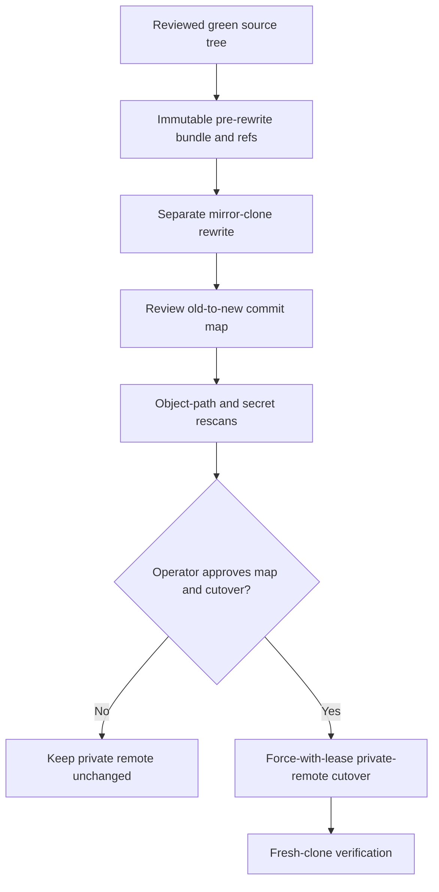

# History rewrite approval gate

This procedure is prepared evidence, not authorization. It must run only after the current source
and documentation changes are archived, reviewed, and merged. It operates in a new mirror clone;
the working repository and its remotes are never rewritten in place.

## Scope

The rewrite removes these raw planning paths from every reachable commit:

- `docs/superpowers/`
- `docs/extraction.md`

The public conclusions that replace them are in
[architecture decisions](architecture-decisions.md), the repository guides, and this gate. Legal
history in `NOTICE`, source code, tests, tags, and all other documentation remain unchanged except
for commit identifiers necessarily rewritten by ancestry.

## Required evidence and approvals



Before any rewrite, record the private remote URL, every ref and peeled object ID, default branch,
visibility, branch protection, and release/tag inventory. Create and independently verify a full
Git bundle. Store the bundle, ref manifest, and checksums outside the clone and outside this
repository.

The archive location is private operator evidence and must not be recorded in this public
repository. Before running the procedure, set `EVIDENCE_ROOT` to a new absolute directory outside
every repository and synchronized workspace. Keep its directories at mode `0700` and its files at
mode `0600`; never copy it into a repository or sync service. Retain it through cutover and
rollback and until the later of 90 days after cutover or 30 days after the repository becomes
public. Deletion requires separate operator approval after that retention deadline.

Use this exact preparation sequence only after the archive gate is approved. `EVIDENCE_ROOT` must
be a new empty directory and must not be the working repository, its parent, or a temporary
directory scheduled for automatic deletion.

```bash
set -euo pipefail
umask 077
readonly SOURCE_REMOTE='git@github.com:groovemap-music/catalog-api.git'
: "${EVIDENCE_ROOT:?Set EVIDENCE_ROOT to a new absolute private evidence directory}"
readonly EVIDENCE_ROOT
test "${EVIDENCE_ROOT}" = "$(python3 -c 'import os, sys; print(os.path.abspath(sys.argv[1]))' "${EVIDENCE_ROOT}")"
test ! -e "${EVIDENCE_ROOT}"
mkdir -m 700 "${EVIDENCE_ROOT}"

git clone --mirror "${SOURCE_REMOTE}" "${EVIDENCE_ROOT}/pre-rewrite.git"
git -C "${EVIDENCE_ROOT}/pre-rewrite.git" for-each-ref \
  --format='%(refname) %(objectname) %(*objectname)' > "${EVIDENCE_ROOT}/input-refs.txt"
git -C "${EVIDENCE_ROOT}/pre-rewrite.git" bundle create \
  "${EVIDENCE_ROOT}/catalog-api-pre-rewrite.bundle" --all
git bundle verify "${EVIDENCE_ROOT}/catalog-api-pre-rewrite.bundle" \
  > "${EVIDENCE_ROOT}/bundle-verify.txt" 2>&1
git clone --mirror "${EVIDENCE_ROOT}/pre-rewrite.git" "${EVIDENCE_ROOT}/rewrite.git"
shasum -a 256 \
  "${EVIDENCE_ROOT}/catalog-api-pre-rewrite.bundle" \
  "${EVIDENCE_ROOT}/input-refs.txt" \
  "${EVIDENCE_ROOT}/bundle-verify.txt" \
  > "${EVIDENCE_ROOT}/pre-rewrite-SHA256SUMS"
find "${EVIDENCE_ROOT}" -type d -exec chmod 700 {} +
find "${EVIDENCE_ROOT}" -type f -exec chmod 600 {} +
```

Before proceeding, compare `input-refs.txt` with a fresh read of the private remote. Any drift
invalidates the preparation and requires a new evidence directory and bundle.

Only after the archive gate is approved, the rewrite tool invocation in the separate mirror is:

```bash
git -C "${EVIDENCE_ROOT}/rewrite.git" filter-repo --force --invert-paths \
  --path docs/superpowers/ \
  --path docs/extraction.md
```

Because `rewrite.git` is a bare mirror, copy `rewrite.git/filter-repo/commit-map` and
`rewrite.git/filter-repo/ref-map` into the external evidence directory. Reviewers must approve
both maps and confirm that every expected branch and tag has a mapped destination before cutover.
A zero old object ID is permitted only for a ref intentionally created after the recorded
snapshot; a zero new object ID is not permitted.

## Verification before cutover

Run all checks against the rewritten mirror and record their output and tool versions:

```bash
readonly REWRITE_MIRROR="${EVIDENCE_ROOT}/rewrite.git"
readonly OBJECT_GRAPH="${EVIDENCE_ROOT}/rewritten-object-graph.txt"
readonly GITLEAKS_CONFIG="${EVIDENCE_ROOT}/rewritten-gitleaks.toml"
git -C "${REWRITE_MIRROR}" show HEAD:.gitleaks.toml > "${GITLEAKS_CONFIG}"
chmod 600 "${GITLEAKS_CONFIG}"
git -C "${REWRITE_MIRROR}" fsck --full --strict
git -C "${REWRITE_MIRROR}" rev-list --objects --all > "${OBJECT_GRAPH}"
! grep -E ' docs/(superpowers/|extraction\.md$)' "${OBJECT_GRAPH}"
gitleaks git --redact --no-banner --config "${GITLEAKS_CONFIG}" "${REWRITE_MIRROR}"
trufflehog git "file://${REWRITE_MIRROR}" --bare --fail --only-verified
```

Create a fresh ordinary clone from the rewritten mirror, run `just setup`, `just check`,
`just audit`, `just image`, `just performance-image`, and `just release-dry-run`, then repeat the
full object-path and secret scans. Sign checksums for the bundle, input refs, maps, extracted
rewritten Gitleaks configuration, scan output, and validation logs.

## Separate cutover approval

No push follows automatically. The operator must explicitly approve the reviewed map, exact
private remote, expected force-with-lease values, maintenance window, rollback owner, and backup
retention. Repository visibility must remain unchanged. Tags, releases, and packages must not be
created or deleted. If any lease differs, the cutover stops and the entire evidence set is rebuilt
from the new remote state.
