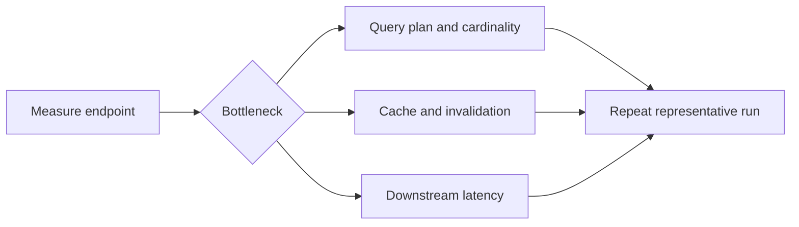

# catalog-api performance

This guide covers performance work owned by `catalog-api`: request measurement, query design,
caching, timeouts, and the `catalog-api-performance` runner. Environment sizing and repeatable
stack orchestration belong to
[`deployment`](https://github.com/groovemap-music/deployment).



## Repository gates

```bash
just check
just performance-image
```

`just check` is deterministic and uses fakes. `just performance-image` builds the repository-named
local runner; it does not start databases, publish an image, or alter a deployment. Run the image
against a disposable, representative stack provisioned by `deployment`.

The runner configuration and full endpoint matrix are documented in
[`performance/README.md`](../performance/README.md). Record the catalog-api revision, promoted
schema and data-image revisions, dataset identity, warm/cold cache state, iteration count, and
host resources with every result.

## Measurement rules

1. Establish a baseline before changing code.
1. Measure warm and cold paths separately.
1. Use p95 and error count in addition to averages.
1. Compare identical dataset and dependency revisions.
1. Profile one query family at a time before changing indexes or caches.
1. Preserve result JSON and logs outside the repository.

Request middleware records bounded per-path latency samples. Identifier path segments are
normalized so metrics do not create an unbounded label set. Health, metrics, and administrative
paths are excluded from ordinary endpoint timing.

## API-owned optimization patterns

### Bound graph work

Use explicit relationship types and directions, index-backed entry points, pagination, and
server-side query timeouts. Batch related lookups rather than issuing one query per candidate.
The detailed query patterns and their measured history are in
[query performance optimizations](query-performance-optimizations.md).

### Bound SQL work

Apply a per-source limit before merging ranked full-text results. Execute independent count and
facet queries concurrently only when their combined database budget remains bounded. The API pool
defaults to a minimum of 2 and maximum of 8; deployment may override those values within its
global database budget.

### Cache stable results

The API owns cache keys, TTLs, and invalidation for its responses. Current examples include:

| Result | Cache behavior |
| --- | --- |
| Genre tree | Five-minute in-process cache |
| Explore and trends | Redis cache for stable imported data |
| Recommendations and label DNA | Redis cache with bounded TTL |
| Search | Redis cache after bounded PostgreSQL queries |
| Data completeness | Six-hour Redis cache for expensive aggregate scans |
| User timeline and collection gaps | Bounded in-process caches |

Cache correctness is part of the API contract: invalidation follows successful writes, a failed
cache should not turn an authorization failure into success, and caches must remain bounded.

## Cross-repository performance ownership

Changes outside the request path must be made in their owning repositories:

- Index and constraint definitions:
  [`database-schema`](https://github.com/groovemap-music/database-schema)
- Discogs graph denormalization:
  [`discogs-graph-enricher`](https://github.com/groovemap-music/discogs-graph-enricher)
- Discogs relational loading:
  [`discogs-sql-loader`](https://github.com/groovemap-music/discogs-sql-loader)
- MusicBrainz graph enrichment:
  [`musicbrainz-graph-enricher`](https://github.com/groovemap-music/musicbrainz-graph-enricher)
- MusicBrainz relational loading:
  [`musicbrainz-sql-loader`](https://github.com/groovemap-music/musicbrainz-sql-loader)
- Precomputed analytics scheduling and storage:
  [`analytics-engine`](https://github.com/groovemap-music/analytics-engine)
- Runtime resource limits, networks, and monitoring:
  [`deployment`](https://github.com/groovemap-music/deployment)

Catalog API changes may consume a promoted contract from those repositories, but they must not
silently rewrite another repository's schema, image, or runtime configuration.

## Review checklist

- Representative endpoint and dataset are identified.
- Baseline and candidate use identical promoted dependencies.
- Query counts, cardinality, p95, and error count improve or remain within budget.
- New caches have bounded size or TTL and tested invalidation.
- New database work has explicit pagination or timeout behavior.
- The default test suite remains isolated from live services.
- Performance results do not contain credentials, tokens, or private URLs.
