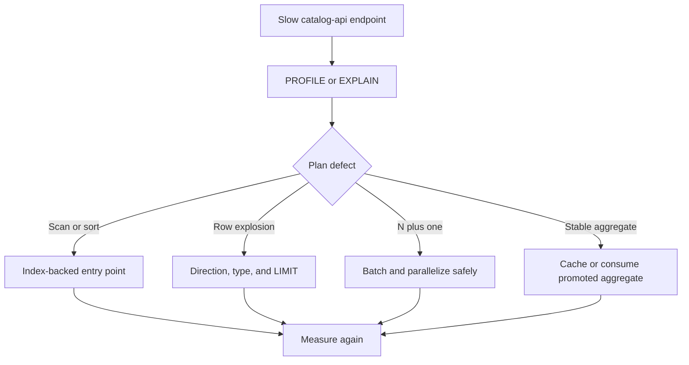

# catalog-api query performance decisions

This report records reusable conclusions from catalog-api query profiling. Historical timings are
directional evidence from a particular dataset, not a guarantee for every deployment. Reproduce
results with the repository [performance runner](../performance/README.md) before accepting a
change.



## Decisions retained in catalog-api

### Prefer typed, directed traversals

Shortest-path and neighborhood queries restrict relationship types and direction. This prevents
the breadth-first search from exploring unrelated edges and makes the allowed graph contract
visible in source.

```cypher
MATCH path = shortestPath(
  (source)-[:BY|ON|IS|ALIAS_OF|MEMBER_OF|MASTER_OF|DERIVED_FROM*..6]-(target)
)
RETURN path
```

### Start from selective indexed nodes

Anchor graph work at an indexed identifier or normalized name before expanding. For minimum and
maximum values, use an index-backed `ORDER BY ... LIMIT 1` subquery instead of aggregating every
node.

### Prevent accidental Cartesian products

Use subqueries or pattern comprehensions when the planner otherwise begins from a high-cardinality
range. Verify the resulting plan; a syntactic `WITH` alone is not a guaranteed optimization
barrier.

### Replace N-plus-one calls with batches

Similarity and profile endpoints collect candidate identifiers first, then fetch profiles in
bounded batches. Independent queries may run concurrently, but concurrency must remain within the
API connection-pool and database budgets.

```cypher
UNWIND $candidate_ids AS candidate_id
MATCH (artist:Artist {id: candidate_id})<-[:BY]-(release:Release)-[:IS]->(genre:Genre)
WITH artist.id AS artist_id, genre.name AS genre, count(DISTINCT release) AS release_count
RETURN artist_id, collect({name: genre, count: release_count}) AS genres
```

### Cap high-cardinality expansions

Apply a limit within each genre, style, or source dimension before combining candidates. Apply
`SKIP` and `LIMIT` at the database boundary for expansion endpoints, and keep auxiliary count work
bounded.

### Share cache entries across endpoints

Endpoint variants that compute the same label DNA, similarity profile, trend, or exploration
result reuse one cache key. A miss may populate the shared entry; successful writes invalidate
affected user-scoped keys.

### Bound full-text search before ranking

PostgreSQL search limits each source relation before the final union and ranking. Count and facet
queries are independent and may run concurrently. A count cap prevents a broad term from turning
metadata queries into full-table work.

### Apply explicit server-side timeouts

Expensive Neo4j calls use `neo4j.Query(..., timeout=...)` through the shared query helper. The
timeout must be comfortably below the server's transaction ceiling so a pathological request
fails predictably instead of consuming the entire deployment budget.

## Similar-artist candidate latency (gm-catalog-api-tsmu.1)

gm-catalog-api-tsmu.1 replaced the similar-artist candidate generator's per-genre caps (top 5
genres, 500 artists per genre, 200 overall, 50 profiled) with a set-based query scoring every
artist sharing at least one genre/style/label/collaborator signal, because the caps were
measurably starving recall (see `docs/evaluation.md`). That is a direct departure from "Cap
high-cardinality expansions" above. Round 2 measured the departure against a synthetic,
catalog-shaped fixture (`scripts/generate_latency_fixture.py`) and found it cost 178-369% p95
over the old path, far past the 20% budget. **Maintainer decision (round 3): keep the
all-signal candidate scope, and improve performance rather than reintroduce a per-genre cap.**
This section records what was measured and implemented, and what is still proposed rather than
decided.

### What shipped

- **`CANDIDATE_PROFILE_LIMIT`** (`api/queries/recommend_queries.py`): an overall cap on how
  many of the query's already-ranked candidates (by shared release count, ties broken by
  artist id) are profiled and scored, pushed into the query itself as a real `LIMIT` in both
  the SQL and the Cypher -- the query still finds and ranks every qualifying artist; only the
  profile-and-score work below that ranking is bounded. This is a single overall cap on the
  ranked set, not a per-genre cap during expansion, and it is overridable per call for the
  sweep below. **Proposed value: 50. Still under review** -- see the sweep for why, and for
  the recall-risk caveat a cap of this shape carries that this investigation could not measure.
- **Concurrent profile-batch queries** (`recommend_pg_queries._batch_artist_profiles`): the
  four dimension queries (genres/styles/labels/collaborators) now run with `asyncio.gather`
  instead of a sequential loop. Neo4j's side already did this; only PostgreSQL was sequential.

### Cap sweep: recall@10 and endpoint p95, N = 50/100/200/500

**Recall@10, golden set, vs heuristics-2026-09 (0.44507) and the uncapped all-signal scope
(0.53614):** identical (0.53614) at every swept N, including no-cap. The golden set has only
36 artists in total, so no swept N ever excludes a candidate the uncapped scope would have
kept -- this shows capping is recall-neutral *on this fixture*, not that it is recall-neutral
at production scale. A cap orders candidates by shared release count, which is a proxy for
final cosine rank, not identical to it; a real catalog could have a candidate that ranks low
by shared count but would have scored highly by cosine similarity on styles/labels, and this
investigation has no fixture large enough to exercise that risk. See
`tests/test_evaluation_similar_artist_candidates.py`.

**Endpoint p95, PG19 integration tier, realistic synthetic fixture (2,500 artists, ~8,000
releases), concurrent profiling throughout, 12 reps.** One representative run below; a repeat
run on the same shared host (the validation slot is shared with other hives) measured mega at
N=50 in a +3.4% to +8.5% band and mid at N=50 consistently negative (faster than legacy) --
absolute numbers vary run to run by tens of percent on a busy host, but N=50 clearing the
budget and N>=100 not reliably clearing it for the mega target held across every run:


| Target | Legacy p95 | N=50 | N=100 | N=200 | N=500 | Uncapped |
| --- | ---: | ---: | ---: | ---: | ---: | ---: |
| Mega (p99 release count, all-mega facets) | 103.31ms | 106.78ms | 131.85ms | 140.80ms | 268.85ms | 435.09ms |
| Mid (median release count) | 104.75ms | 89.28ms | 93.83ms | 113.68ms | 139.79ms | 212.10ms |
| Niche (all-niche facets, few releases) | 22.61ms | 44.33ms | 61.90ms | 53.41ms | 49.73ms | 48.99ms |

**Delta vs legacy p95:**

| Target | N=50 | N=100 | N=200 | N=500 | Uncapped |
| --- | ---: | ---: | ---: | ---: | ---: |
| Mega | **+3.4%** | +27.6% | +36.3% | +160.2% | +321.1% |
| Mid | **-14.8%** | -10.4% | +8.5% | +33.4% | +102.5% |
| Niche | +96.1% | +173.7% | +136.2% | +119.9% | +116.7% |

N=50 is the only value that clears the 20% budget for the mega target (+3.4%); mid clears it
at every swept N. Niche's deltas are noise, not signal: its candidate count is 13 at every N
from 50 upward (the query never finds more than 13 candidates for this target regardless of
cap), so "capped-100" and "capped-500" are the *same query* as uncapped for this target, and
the swing between them (44ms to 62ms) is measurement variance on an endpoint that costs
20-70ms in absolute terms. The niche row should be read as "roughly 45-60ms, cap-independent,"
not as a real per-N trend.

### Concurrency gain, isolated from the cap

Measured on the uncapped query (so the only variable is sequential vs concurrent profiling):

| Target | Sequential p95 | Concurrent p95 | Gain |
| --- | ---: | ---: | ---: |
| Mega | 468.72ms | 435.09ms | -7.2% |
| Mid | 264.48ms | 212.10ms | -19.8% |
| Niche | 68.63ms | 48.99ms | -28.6% |

Concurrency helps more, in relative terms, the smaller the candidate list: at mega scale the
`ANY(huge_array)` cost of each of the four profile queries dominates regardless of whether they
run one after another or together, so overlapping them saves less. It is a real, unconditional
improvement (implemented for all paths, not just the capped one) but on its own does not close
the gap at mega scale.

### Cap gain, isolated from concurrency

Measured with concurrent profiling throughout (so the only variable is the cap), uncapped vs
each N:

| Target | N=50 | N=100 | N=200 | N=500 |
| --- | ---: | ---: | ---: | ---: |
| Mega | -75.5% | -69.7% | -67.6% | -38.2% |
| Mid | -57.9% | -55.8% | -46.4% | -34.1% |
| Niche | -9.5% | (noise) | (noise) | (noise) |

The cap is where nearly all of the recovery comes from; concurrency is a smaller, unconditional
addition on top of it.

### Where the cost goes (`EXPLAIN (ANALYZE, BUFFERS)`)

The candidate SQL itself is not the dominant cost even uncapped: 70.86ms for mega, 38.31ms for
mid, 1.7-2.2ms for niche (round 2 and round 3 EXPLAIN runs agree). The rest is profiling and
scoring every matched candidate in Python. One planner detail worth watching, not a confirmed
problem: the final join from the ranked candidate set to `graph.artist` (for the name and the
`name IS NOT NULL` filter) chose a hash join with a full `Seq Scan on artists` as the build
side on the 2,500-row fixture, rather than an index nested loop from the (much smaller) ranked
set. That is the right plan at this table size; whether it stays the right plan, or the planner
switches to a nested loop once `artists` holds millions of rows and the ranked set is
comparatively tiny, is a real-scale question this fixture cannot answer. **No index change is
proposed here** -- indexes live in `database-schema`, and it may not need one if the planner's
own cost model already switches plans at scale, in which case this note is closed with no
action; if it does not, the candidate fix is `graph.artist`'s existing primary-key index, which
already exists, just needs the planner steered onto it (e.g. `analyze`, or a targeted
`enable_hashjoin=off` check to confirm the nested loop is actually cheaper before asking for
any schema change).

### Scaling: 2,500 artists vs 30,000 artists, same shape

The round-2/3 fixture is roughly three orders of magnitude below a production catalog, and it
shows: at 2,500 artists the mega target's candidate pool is 1,854 -- 74% of every artist in the
fixture, not a shape a real catalog has at any size. A ~12x larger fixture (30,000 artists,
100,000 releases, same generator, same shape) was seeded and measured on the mega target:

| Fixture | Artists | Releases | Mega candidates (uncapped, bare SQL) |
| --- | ---: | ---: | ---: |
| Small | 2,500 | 8,005 | 1,854 |
| Large | 30,000 | 100,005 | 25,521 |

| Variant | Small p95 | Large p95 | Scale factor |
| --- | ---: | ---: | ---: |
| Legacy | 97.02ms | 890.31ms | 9.18x |
| New, capped at 200, concurrent | 124.36ms | 1436.01ms | 11.55x |

Two findings:

1. **The legacy path is not immune to catalog growth either.** Its inner per-genre scan
   (`ORDER BY release_id LIMIT 100000`) costs work proportional to genre size up to that
   100k-release ceiling, and neither fixture's mega genres (2,022 and ~25,000 releases) reach
   it -- so this comparison has not yet found the point where legacy's own cap plateaus its
   cost, only confirmed that below it, legacy also scales with the catalog.
2. **The capped-200 path's overhead over legacy is roughly stable as the catalog grows.** At
   small scale it was +36.3% over legacy for the mega target (per the sweep above); at 12x the
   scale it is +61.3% (1436.01 / 890.31). Worse, but not exploding -- the relative cost of this
   design does not appear to compound with catalog size within the range measured, though two
   points is a trend line, not a proof.
3. The uncapped path was not measured end-to-end at the large size: an early run of this test
   timed out inside `compute_similar_artists` doing exactly that. Profiling and scoring every
   match against a mega-genre target is not just slower at this scale, it is impractical --
   which is itself evidence for capping rather than an oversight in the test.

### Directions still open

- **The proposed N=50 default clears the measured budget but is the smallest value swept,**
  and this investigation has no fixture that can validate its recall risk at production scale
  (see the sweep section above). A maintainer familiar with the real catalog's genre
  distribution is better placed to judge whether 50 is too aggressive.
- **Precomputing or caching the candidate pool for the handful of facets that are actually
  broad** (mega genres/styles/labels are, by construction, few and stable) would let the
  uncapped, full-recall path be used for the common case (where it is already cheap) and
  reserve the cap for genuinely broad targets only.
- **The `graph.artist` join plan** noted above, once real table sizes are available to check
  against.
- **Vectorizing `compute_similar_artists`** was considered but not pursued: at N<=500 candidates
  it did not show up as the dominant cost in the EXPLAIN/timing breakdown (the SQL profile
  batches did), so it is not where the next unit of engineering effort would pay off first.

## Ownership of supporting data work

Some effective optimizations require a change outside catalog-api. Those changes are promoted into
this repository only after validation by their owners:

- Neo4j and PostgreSQL indexes and constraints:
  [`database-schema`](https://github.com/groovemap-music/database-schema)
- Discogs graph properties and relationships:
  [`discogs-graph-enricher`](https://github.com/groovemap-music/discogs-graph-enricher)
- Discogs relational data and indexes tied to loading:
  [`discogs-sql-loader`](https://github.com/groovemap-music/discogs-sql-loader)
- MusicBrainz graph metadata:
  [`musicbrainz-graph-enricher`](https://github.com/groovemap-music/musicbrainz-graph-enricher)
- MusicBrainz relational metadata:
  [`musicbrainz-sql-loader`](https://github.com/groovemap-music/musicbrainz-sql-loader)
- Precomputed trend and completeness results:
  [`analytics-engine`](https://github.com/groovemap-music/analytics-engine)

The catalog API may read a promoted property or proxy an analytics result. It does not own import
jobs, database initialization, or analytics scheduling.

## Historical result summary

The original profiling effort found the largest improvements in these categories:

| Query family | Retained technique |
| --- | --- |
| Path finding | Typed relationship traversal and bounded depth |
| Genre and style exploration | Indexed anchors and promoted aggregate properties |
| Artist and label similarity | Candidate caps, batched profiles, and Redis caching |
| Label DNA | Shared cache reuse |
| Full-text search | Per-table limits, concurrent facets, and bounded counts |
| Year range | Index-backed first and last entry |
| Expansion | Database-side pagination |

Exact graph sizes and latency numbers age with every promoted data release. Keep raw benchmark
artifacts outside the repository and record their catalog-api, schema, loader, enricher, analytics,
and deployment revisions.

## Acceptance checklist

- The endpoint has a representative regression test.
- The plan starts from a selective indexed operation.
- Traversal direction, relationship types, pagination, and timeouts are explicit.
- Candidate and cache sizes are bounded.
- Warm and cold results are reported separately.
- The optimization does not claim ownership of another repository's runtime or data pipeline.
