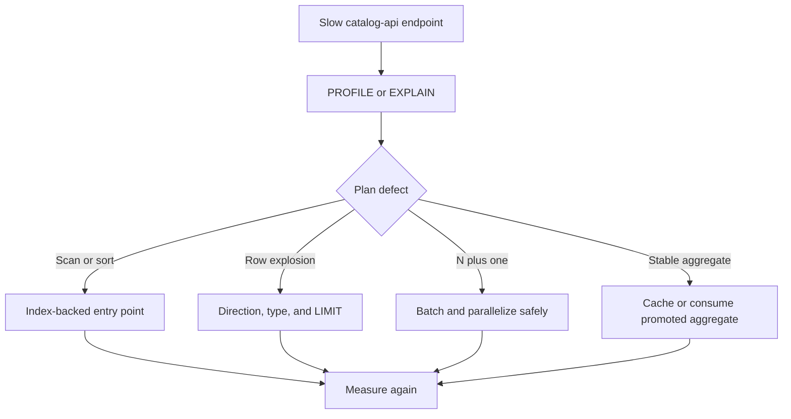

# catalog-api query performance decisions

This report records reusable conclusions from catalog-api query profiling. Historical timings are
directional evidence from a particular dataset, not a guarantee for every deployment. Reproduce
results with the repository [performance runner](../performance/README.md) before accepting a
change.



## Decisions retained in catalog-api

### Prefer typed, directed traversals

Shortest-path and neighborhood queries restrict relationship types and direction. This prevents
the breadth-first search from exploring unrelated edges and makes the allowed graph contract
visible in source.

```cypher
MATCH path = shortestPath(
  (source)-[:BY|ON|IS|ALIAS_OF|MEMBER_OF|MASTER_OF|DERIVED_FROM*..6]-(target)
)
RETURN path
```

### Start from selective indexed nodes

Anchor graph work at an indexed identifier or normalized name before expanding. For minimum and
maximum values, use an index-backed `ORDER BY ... LIMIT 1` subquery instead of aggregating every
node.

### Prevent accidental Cartesian products

Use subqueries or pattern comprehensions when the planner otherwise begins from a high-cardinality
range. Verify the resulting plan; a syntactic `WITH` alone is not a guaranteed optimization
barrier.

### Replace N-plus-one calls with batches

Similarity and profile endpoints collect candidate identifiers first, then fetch profiles in
bounded batches. Independent queries may run concurrently, but concurrency must remain within the
API connection-pool and database budgets.

```cypher
UNWIND $candidate_ids AS candidate_id
MATCH (artist:Artist {id: candidate_id})<-[:BY]-(release:Release)-[:IS]->(genre:Genre)
WITH artist.id AS artist_id, genre.name AS genre, count(DISTINCT release) AS release_count
RETURN artist_id, collect({name: genre, count: release_count}) AS genres
```

### Cap high-cardinality expansions

Apply a limit within each genre, style, or source dimension before combining candidates. Apply
`SKIP` and `LIMIT` at the database boundary for expansion endpoints, and keep auxiliary count work
bounded.

### Share cache entries across endpoints

Endpoint variants that compute the same label DNA, similarity profile, trend, or exploration
result reuse one cache key. A miss may populate the shared entry; successful writes invalidate
affected user-scoped keys.

### Bound full-text search before ranking

PostgreSQL search limits each source relation before the final union and ranking. Count and facet
queries are independent and may run concurrently. A count cap prevents a broad term from turning
metadata queries into full-table work.

### Apply explicit server-side timeouts

Expensive Neo4j calls use `neo4j.Query(..., timeout=...)` through the shared query helper. The
timeout must be comfortably below the server's transaction ceiling so a pathological request
fails predictably instead of consuming the entire deployment budget.

## Open investigation: similar-artist candidate latency (gm-catalog-api-tsmu.1)

gm-catalog-api-tsmu.1 replaced the similar-artist candidate generator's per-genre caps (top 5
genres, 500 artists per genre, 200 overall, 50 profiled) with a set-based query scoring every
artist sharing at least one genre/style/label/collaborator signal, because the caps were
measurably starving recall (see `docs/evaluation.md`). That is a direct departure from "Cap
high-cardinality expansions" above, and measuring it against a synthetic, catalog-shaped
fixture (mega genres/styles/labels, a long tail, a prolific artist at ~p99 release count --
`scripts/generate_latency_fixture.py`, benchmarked in
`tests/test_recommend_candidate_latency.py`) shows the departure costs more than the 20%
budget the change was supposed to stay inside. This section records the finding rather than a
retained decision, because there isn't one yet -- it needs a maintainer call.

**Measured on the PG19 integration tier, endpoint-shaped (identity + profile + candidates +
scoring, not bare SQL), p95 of 15 reps:**

| Target | Candidates | Legacy p95 | New p95 | Delta |
| --- | ---: | ---: | ---: | ---: |
| Mega (p99 release count, all-mega facets) | 1854 | 91.08ms | 426.80ms | +368.6% |
| Mid (median release count) | 1321 | 68.81ms | 225.43ms | +227.6% |
| Niche (all-niche facets, few releases) | 13 | 24.34ms | 67.79ms | +178.5% |

Two findings narrow where a fix would need to go:

1. **The candidate SQL itself is not the dominant cost.** `EXPLAIN (ANALYZE, BUFFERS)` of the
   uncapped query alone measured 70.86ms for the mega target and 38.31ms for mid -- real, but
   a fraction of the endpoint totals above. The rest is profiling and scoring every matched
   candidate: `_batch_artist_profiles` runs four sequential queries with `artist_id = ANY(...)`
   over the full candidate id list, and `compute_similar_artists` scores every one of them in
   Python before ranking. Neither existed as a cost center under the old generator because it
   never profiled more than 50 candidates.
2. **An overall post-hoc cap on the profiled set, not a per-genre one, recovers most but not
   all of the regression.** Capping to the top 200 candidates by the query's own
   `release_count DESC` order (which already reflects genuine multi-signal overlap, not just
   genre) -- experimental only, not implemented in `recommend_pg_queries.py` -- measured:

   | Target | Capped-200 p95 | Delta vs legacy |
   | --- | ---: | ---: |
   | Mega | 143.50ms | +57.6% |
   | Mid | 113.64ms | +65.1% |
   | Niche | 57.55ms | +136.4% |

   Mega and mid drop from the 200-370% range to roughly 60%, still over budget. Niche barely
   moves (it only had 13 candidates to begin with) and stays disproportionately regressed in
   relative terms even though its absolute latency (57-68ms) is small -- something about the
   new query's shape (the four-way `UNION` and its CTEs, versus the old query's single
   `LATERAL` expansion) appears to carry fixed overhead independent of candidate count, which
   this investigation has not isolated further.

Directions worth a maintainer decision, none implemented here:

- The overall cap above, sized to actually clear 20% (200 did not; a smaller cap, or batching
  the four profile queries concurrently instead of sequentially, might).
- Precomputing or caching the candidate pool for the handful of facets that are actually
  broad (mega genres/styles/labels are, by construction, few and stable), leaving the
  uncapped query only for the common case where it is already cheap.
- Investigating the niche case's fixed overhead directly (a warm-connection or per-query
  planning cost that a smaller candidate set does not amortize) before concluding a cap alone
  is sufficient.

## Ownership of supporting data work

Some effective optimizations require a change outside catalog-api. Those changes are promoted into
this repository only after validation by their owners:

- Neo4j and PostgreSQL indexes and constraints:
  [`database-schema`](https://github.com/groovemap-music/database-schema)
- Discogs graph properties and relationships:
  [`discogs-graph-enricher`](https://github.com/groovemap-music/discogs-graph-enricher)
- Discogs relational data and indexes tied to loading:
  [`discogs-sql-loader`](https://github.com/groovemap-music/discogs-sql-loader)
- MusicBrainz graph metadata:
  [`musicbrainz-graph-enricher`](https://github.com/groovemap-music/musicbrainz-graph-enricher)
- MusicBrainz relational metadata:
  [`musicbrainz-sql-loader`](https://github.com/groovemap-music/musicbrainz-sql-loader)
- Precomputed trend and completeness results:
  [`analytics-engine`](https://github.com/groovemap-music/analytics-engine)

The catalog API may read a promoted property or proxy an analytics result. It does not own import
jobs, database initialization, or analytics scheduling.

## Historical result summary

The original profiling effort found the largest improvements in these categories:

| Query family | Retained technique |
| --- | --- |
| Path finding | Typed relationship traversal and bounded depth |
| Genre and style exploration | Indexed anchors and promoted aggregate properties |
| Artist and label similarity | Candidate caps, batched profiles, and Redis caching |
| Label DNA | Shared cache reuse |
| Full-text search | Per-table limits, concurrent facets, and bounded counts |
| Year range | Index-backed first and last entry |
| Expansion | Database-side pagination |

Exact graph sizes and latency numbers age with every promoted data release. Keep raw benchmark
artifacts outside the repository and record their catalog-api, schema, loader, enricher, analytics,
and deployment revisions.

## Acceptance checklist

- The endpoint has a representative regression test.
- The plan starts from a selective indexed operation.
- Traversal direction, relationship types, pagination, and timeouts are explicit.
- Candidate and cache sizes are bounded.
- Warm and cold results are reported separately.
- The optimization does not claim ownership of another repository's runtime or data pipeline.
