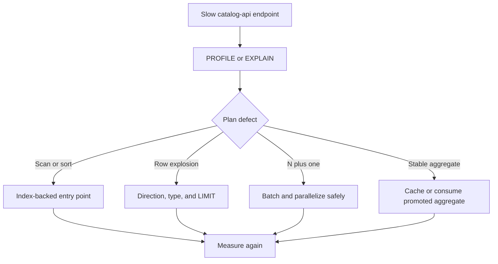

# catalog-api query performance decisions

This report records reusable conclusions from catalog-api query profiling. Historical timings are
directional evidence from a particular dataset, not a guarantee for every deployment. Reproduce
results with the repository [performance runner](../performance/README.md) before accepting a
change.



## Decisions retained in catalog-api

### Prefer typed, directed traversals

Shortest-path and neighborhood queries restrict relationship types and direction. This prevents
the breadth-first search from exploring unrelated edges and makes the allowed graph contract
visible in source.

```cypher
MATCH path = shortestPath(
  (source)-[:BY|ON|IS|ALIAS_OF|MEMBER_OF|MASTER_OF|DERIVED_FROM*..6]-(target)
)
RETURN path
```

### Start from selective indexed nodes

Anchor graph work at an indexed identifier or normalized name before expanding. For minimum and
maximum values, use an index-backed `ORDER BY ... LIMIT 1` subquery instead of aggregating every
node.

### Prevent accidental Cartesian products

Use subqueries or pattern comprehensions when the planner otherwise begins from a high-cardinality
range. Verify the resulting plan; a syntactic `WITH` alone is not a guaranteed optimization
barrier.

### Replace N-plus-one calls with batches

Similarity and profile endpoints collect candidate identifiers first, then fetch profiles in
bounded batches. Independent queries may run concurrently, but concurrency must remain within the
API connection-pool and database budgets.

```cypher
UNWIND $candidate_ids AS candidate_id
MATCH (artist:Artist {id: candidate_id})<-[:BY]-(release:Release)-[:IS]->(genre:Genre)
WITH artist.id AS artist_id, genre.name AS genre, count(DISTINCT release) AS release_count
RETURN artist_id, collect({name: genre, count: release_count}) AS genres
```

### Cap high-cardinality expansions

Apply a limit within each genre, style, or source dimension before combining candidates. Apply
`SKIP` and `LIMIT` at the database boundary for expansion endpoints, and keep auxiliary count work
bounded.

### Share cache entries across endpoints

Endpoint variants that compute the same label DNA, similarity profile, trend, or exploration
result reuse one cache key. A miss may populate the shared entry; successful writes invalidate
affected user-scoped keys.

### Bound full-text search before ranking

PostgreSQL search limits each source relation before the final union and ranking. Count and facet
queries are independent and may run concurrently. A count cap prevents a broad term from turning
metadata queries into full-table work.

### Apply explicit server-side timeouts

Expensive Neo4j calls use `neo4j.Query(..., timeout=...)` through the shared query helper. The
timeout must be comfortably below the server's transaction ceiling so a pathological request
fails predictably instead of consuming the entire deployment budget.

## Similar-artist candidate latency (gm-catalog-api-tsmu.1)

gm-catalog-api-tsmu.1 set out to replace the similar-artist candidate generator's per-genre
caps (top 5 genres, 500 artists per genre, 200 overall, 50 profiled) with a set-based query
scoring every artist sharing at least one genre/style/label/collaborator signal, because the
caps were measurably starving recall (see `docs/evaluation.md`). That is a direct departure
from "Cap high-cardinality expansions" above, and across rounds 2-4 it was measured, tried with
two mitigations, and re-measured more rigorously -- documented in full below, because the
investigation and its numbers are the useful output even though the change did not ship.

**Maintainer decision (round 5, option (b)): the production similar-artist path stays on the
legacy per-genre-capped generator.** The serving-side improvement moves to
`gm-catalog-api-2zsq` (kNN retrieval over precomputed embeddings) instead of a rewritten SQL
candidate query. What stays from this bead:

- **`api/evaluation`'s registered baseline**, `similar-artist-all-signals-2026-09`
  (`GoldenGraph.candidate_artists_all_signals`, its own committed snapshot,
  `heuristics-2026-09` untouched) -- an offline comparison point, not a serving path.
- **The latency fixture generator and benchmark**
  (`scripts/generate_latency_fixture.py`, `tests/test_recommend_candidate_latency.py`), kept
  reproducible for whichever design ends up serving `gm-catalog-api-2zsq`. The all-signal SQL
  itself lives in `tests/all_signal_recommend_sql.py` -- evaluation/benchmark-only, mirroring
  how `tests/graph_fixture.py` and other test-side modules hold query text that is not
  production code.
- **This document**, with all four rounds' numbers and the conclusion below.

Nothing in `api/` outside `api/evaluation` references the all-signal query.
`api/queries/recommend_queries.py` and `recommend_pg_queries.py` are back to the legacy
candidate generator, byte-identical to before this bead.

### What was tried and reverted

- **An overall profile/score cap** (`CANDIDATE_PROFILE_LIMIT`, swept at N=50/100/200/500):
  bounded how many of the query's already-ranked candidates (by shared release count, ties
  broken by artist id) were profiled and scored, via a real `LIMIT` in both the SQL and the
  Cypher. Round 3 read N=50 as clearing the endpoint's 20% p95 budget; round 4's more rigorous
  re-measurement found that reading did not hold up (see below). Reverted along with the rest
  of the candidate-query change.
- **Concurrent profile-batch queries** (the four dimension queries run with `asyncio.gather`
  instead of a sequential loop): a real, unconditional latency improvement on its own (see
  "Concurrency gain" below) that was reverted along with the candidate query it was profiling,
  since it was written specifically for `_batch_artist_profiles` at the shape the all-signal
  query needed. **Recommended as a separate follow-up**, independent of this bead: it applies
  equally well to the legacy candidate query's own profile-batch fetch and costs nothing in
  recall or correctness. Measured gain is below ("Concurrency gain, isolated from the cap").

### Cap sweep: recall@10 and endpoint p95, N = 50/100/200/500

**Recall@10, golden set, vs heuristics-2026-09 (0.44507) and the uncapped all-signal scope
(0.53614):** identical (0.53614) at every swept N, including no-cap. The golden set has only
36 artists in total, so no swept N ever excludes a candidate the uncapped scope would have
kept -- this shows capping is recall-neutral *on this fixture*, not that it is recall-neutral
at production scale. A cap orders candidates by shared release count, which is a proxy for
final cosine rank, not identical to it; a real catalog could have a candidate that ranks low
by shared count but would have scored highly by cosine similarity on styles/labels, and this
investigation has no fixture large enough to exercise that risk. See
`tests/test_evaluation_similar_artist_candidates.py`.

**Endpoint p95, PG19 integration tier, realistic synthetic fixture (2,500 artists, ~8,000
releases), concurrent profiling throughout, 12 reps.** One representative run below; a repeat
run on the same shared host (the validation slot is shared with other hives) measured mega at
N=50 in a +3.4% to +8.5% band and mid at N=50 consistently negative (faster than legacy) --
absolute numbers vary run to run by tens of percent on a busy host, but N=50 clearing the
budget and N>=100 not reliably clearing it for the mega target held across every run:

| Target | Legacy p95 | N=50 | N=100 | N=200 | N=500 | Uncapped |
| --- | ---: | ---: | ---: | ---: | ---: | ---: |
| Mega (p99 release count, all-mega facets) | 103.31ms | 106.78ms | 131.85ms | 140.80ms | 268.85ms | 435.09ms |
| Mid (median release count) | 104.75ms | 89.28ms | 93.83ms | 113.68ms | 139.79ms | 212.10ms |
| Niche (all-niche facets, few releases) | 22.61ms | 44.33ms | 61.90ms | 53.41ms | 49.73ms | 48.99ms |

**Delta vs legacy p95:**

| Target | N=50 | N=100 | N=200 | N=500 | Uncapped |
| --- | ---: | ---: | ---: | ---: | ---: |
| Mega | **+3.4%** | +27.6% | +36.3% | +160.2% | +321.1% |
| Mid | **-14.8%** | -10.4% | +8.5% | +33.4% | +102.5% |
| Niche | +96.1% | +173.7% | +136.2% | +119.9% | +116.7% |

N=50 is the only value that clears the 20% budget for the mega target (+3.4%); mid clears it
at every swept N. Niche's deltas are noise, not signal: its candidate count is 13 at every N
from 50 upward (the query never finds more than 13 candidates for this target regardless of
cap), so "capped-100" and "capped-500" are the *same query* as uncapped for this target, and
the swing between them (44ms to 62ms) is measurement variance on an endpoint that costs
20-70ms in absolute terms. The niche row should be read as "roughly 45-60ms, cap-independent,"
not as a real per-N trend.

### Concurrency gain, isolated from the cap

Measured on the uncapped query (so the only variable is sequential vs concurrent profiling):

| Target | Sequential p95 | Concurrent p95 | Gain |
| --- | ---: | ---: | ---: |
| Mega | 468.72ms | 435.09ms | -7.2% |
| Mid | 264.48ms | 212.10ms | -19.8% |
| Niche | 68.63ms | 48.99ms | -28.6% |

Concurrency helps more, in relative terms, the smaller the candidate list: at mega scale the
`ANY(huge_array)` cost of each of the four profile queries dominates regardless of whether they
run one after another or together, so overlapping them saves less. It is a real, unconditional
improvement (implemented for all paths, not just the capped one) but on its own does not close
the gap at mega scale.

### Cap gain, isolated from concurrency

Measured with concurrent profiling throughout (so the only variable is the cap), uncapped vs
each N:

| Target | N=50 | N=100 | N=200 | N=500 |
| --- | ---: | ---: | ---: | ---: |
| Mega | -75.5% | -69.7% | -67.6% | -38.2% |
| Mid | -57.9% | -55.8% | -46.4% | -34.1% |
| Niche | -9.5% | (noise) | (noise) | (noise) |

The cap is where nearly all of the recovery comes from; concurrency is a smaller, unconditional
addition on top of it.

### Where the cost goes (`EXPLAIN (ANALYZE, BUFFERS)`)

The candidate SQL itself is not the dominant cost even uncapped: 70.86ms for mega, 38.31ms for
mid, 1.7-2.2ms for niche (round 2 and round 3 EXPLAIN runs agree). The rest is profiling and
scoring every matched candidate in Python. One planner detail worth watching, not a confirmed
problem: the final join from the ranked candidate set to `graph.artist` (for the name and the
`name IS NOT NULL` filter) chose a hash join with a full `Seq Scan on artists` as the build
side on the 2,500-row fixture, rather than an index nested loop from the (much smaller) ranked
set. That is the right plan at this table size; whether it stays the right plan, or the planner
switches to a nested loop once `artists` holds millions of rows and the ranked set is
comparatively tiny, is a real-scale question this fixture cannot answer. **No index change is
proposed here** -- indexes live in `database-schema`, and it may not need one if the planner's
own cost model already switches plans at scale, in which case this note is closed with no
action; if it does not, the candidate fix is `graph.artist`'s existing primary-key index, which
already exists, just needs the planner steered onto it (e.g. `analyze`, or a targeted
`enable_hashjoin=off` check to confirm the nested loop is actually cheaper before asking for
any schema change).

### Scaling: 2,500 artists vs 30,000 artists, same shape

The round-2/3 fixture is roughly three orders of magnitude below a production catalog, and it
shows: at 2,500 artists the mega target's candidate pool is 1,854 -- 74% of every artist in the
fixture, not a shape a real catalog has at any size. A ~12x larger fixture (30,000 artists,
100,000 releases, same generator, same shape) was seeded and measured on the mega target:

| Fixture | Artists | Releases | Mega candidates (uncapped, bare SQL) |
| --- | ---: | ---: | ---: |
| Small | 2,500 | 8,005 | 1,854 |
| Large | 30,000 | 100,005 | 25,521 |

| Variant | Small p95 | Large p95 | Scale factor |
| --- | ---: | ---: | ---: |
| Legacy | 97.02ms | 890.31ms | 9.18x |
| New, capped at 200, concurrent | 124.36ms | 1436.01ms | 11.55x |

Two findings:

1. **The legacy path is not immune to catalog growth either.** Its inner per-genre scan
   (`ORDER BY release_id LIMIT 100000`) costs work proportional to genre size up to that
   100k-release ceiling, and neither fixture's mega genres (2,022 and ~25,000 releases) reach
   it -- so this comparison has not yet found the point where legacy's own cap plateaus its
   cost, only confirmed that below it, legacy also scales with the catalog.
2. **The capped-200 path's overhead over legacy is roughly stable as the catalog grows.** At
   small scale it was +36.3% over legacy for the mega target (per the sweep above); at 12x the
   scale it is +61.3% (1436.01 / 890.31). Worse, but not exploding -- the relative cost of this
   design does not appear to compound with catalog size within the range measured, though two
   points is a trend line, not a proof.
3. The uncapped path was not measured end-to-end at the large size: an early run of this test
   timed out inside `compute_similar_artists` doing exactly that. Profiling and scoring every
   match against a mega-genre target is not just slower at this scale, it is impractical --
   which is itself evidence for capping rather than an oversight in the test.

### Round 4: interleaved re-measurement reverses the N=50 reading

Round 3's sweep ran each variant in its own block (all reps of "legacy", then all reps of
each capped N, in order). On a host whose load drifts over the measurement window -- true
here, the validation slot is shared with other hives -- that biases whichever variant happens
to run during a quiet or busy stretch, and the sweep order (legacy first, capped-500 last)
matches exactly the direction that bias would need to run to make N=50 look artificially
close to legacy and N=500 look artificially far from it. Per review, round 4 re-measured with
every variant **interleaved per rep** (alternating legacy, N=50, N=100, N=200, N=500 on every
single rep, not in blocks), **>=50 reps per variant per target** (up from 12-15), reporting
**p50/p95 plus spread** (min/max, IQR), over **3 repeated interleaved trials** in the same live
session. `tests/test_recommend_candidate_latency.py`'s two `*_interleaved_sweep_*` tests.

**Small fixture (2,500 artists), PG19, one representative trial of three (p95, ms):**

| Target | Legacy | N=50 | N=100 | N=200 | N=500 |
| --- | ---: | ---: | ---: | ---: | ---: |
| Mega | 152-155 | 143-190 | 161-197 | 192-243 | 301-353 |
| Mid | 99-129 | 101-114 | 104-126 | 124-141 | 169-194 |
| Niche | 20-24 | 65-73 | 66-79 | 64-78 | 68-83 |

(Ranges are across the 3 trials, same variant, same target -- i.e. this is the round-to-round
variation, not a per-rep spread.) Reading this honestly: **for the mega target, N=50 is no
longer clearly inside the 20% budget.** Per-trial deltas vs legacy were +10.4%, -6.4%, and
+24.7% -- straddling the budget rather than sitting inside it. Mid stays comfortably under
budget at every N up to 200. Niche's absolute jump (a stable ~45-50ms) is now visibly a real,
reproducible fixed cost of the new query's shape (four-way `UNION` plus CTEs vs. the old
query's single `LATERAL` expansion), not noise -- it shows up consistently across all 3 trials
with tight spread at 50 reps, where round 3's 12-15 reps could not distinguish it from noise.

**30,000-artist fixture, mega target, PG19, all 3 trials (p95, ms):**

| Trial | Legacy | N=50 | N=200 |
| --- | ---: | ---: | ---: |
| 0 | 952.38 | 1346.39 (+41.4%) | 1648.12 (+73.1%) |
| 1 | 879.32 | 1414.14 (+60.8%) | 1717.42 (+95.3%) |
| 2 | 1218.83 | 1853.55 (+52.1%) | 2246.43 (+84.3%) |

**At the scale this fixture reaches, N=50 does not clear the 20% budget in any of the 3
trials** -- the earlier "N=50 clears it" reading came from a fixture 12x smaller and a
measurement methodology now shown to have biased the sweep in exactly the direction that made
N=50 look best. This is the central finding of round 4: **the profile-count cap alone,
at any of the swept values, is not sufficient at realistic scale.** The candidate SQL's own
ranking/aggregation step -- the `UNION` and `GROUP BY` over every matching row, which runs
before the `LIMIT` and is not reduced by a smaller N -- is a growing share of the cost as the
catalog grows, and capping the *profiled* set does not touch it.

Round 4's finding -- that no swept N clears the 20% budget at realistic scale, because the
candidate SQL's own ranking/aggregation cost grows with the catalog and the profile cap does
not touch it -- is what led to the round-5 decision above: rather than chase a cap value or a
precompute/cache layer for this query shape, the serving-side improvement moves to
`gm-catalog-api-2zsq`'s kNN retrieval design instead.

### Directions for whichever design serves gm-catalog-api-2zsq

These are not decisions, just what this investigation learned that the next design should
know:

- **A profile-count cap alone is not sufficient at realistic scale**, at any of the values
  swept here (50-500). Whatever replaces the legacy generator needs to bound the candidate
  *search* itself, not just how many of its results get profiled and scored.
- **Precomputing or caching the candidate pool for the handful of facets that are actually
  broad** (mega genres/styles/labels are, by construction, few and stable) was the most
  promising direction this investigation identified for a search-side fix, if a search-based
  design were pursued further. kNN retrieval over precomputed embeddings (the chosen path)
  sidesteps the problem differently, by not doing a candidate search at request time at all.
- **The `graph.artist` join plan** noted above is worth a look at real table sizes regardless
  of which design serves this endpoint, since any candidate-style query will hit the same join.
- **Vectorizing `compute_similar_artists`** was considered and not pursued here: at N<=500
  candidates it did not show up as the dominant cost in the EXPLAIN/timing breakdown (the SQL
  side did). Worth reconsidering only if a future design profiles/scores at a similar N.
- **Concurrent profile-batch queries**, reverted from this bead's candidate query but
  applicable to the legacy generator's own profile fetch regardless of what serves similarity
  next -- see "What was tried and reverted" above.

### Part B: production-scale recall, gm-design-chw.2 harness (round 5)

The maintainer cleared disk and approved running the gm-design-chw.2 spike harness's proxy
recall@10 methodology (relevant(A) = artists A works with on a post-cut release; see that
spike's own doc for the full protocol) with the all-signal candidate query at each swept N,
against the real Discogs-dump-derived subset the original spike used -- not the 36-artist
golden set, which is too small to show a cap's recall risk at all (every swept N was identical
there). This closes the "held" item from earlier rounds.

**Harness change.** A copy of `gm-design-chw.2` was made outside any repo
(`~/.cache/groovemap-spikes/graphemb/harness/`, per the spike's own README pattern) --
the design repo itself was never modified. Two additions, both evaluation/harness-only:

- `catalog.py`: `Heuristic.candidate_artists_all_signals(artist, profile=None, *, limit=None)`,
  mirroring `api/evaluation/graph.py`'s `GoldenGraph.candidate_artists_all_signals` /
  `tests/all_signal_recommend_sql.py`'s SQL over the harness's sparse release-facet matrices
  (`catalog.by`, `.genres`, `.styles`, `.labels`): every release touching a genre/style/label
  the target's own releases touch, plus the target's own releases (collaborator), reduced to a
  per-candidate distinct-release count, filtered by `MIN_ARTIST_RELEASES`, ranked by
  (`-count`, the harness's tiebreak key), sliced to `limit`. `similar_all_signals(artist,
  limit=N)` wraps it with the identical `bp.compute_similar_artists` call `similar()`
  (the production-path replay) uses -- only the candidate scope differs.
- `evaluate.py`: a loop after the existing production-path replay, calling
  `heur.similar_all_signals(int(a), limit=N)` for N in 50/100/200/500 (not `uncapped` -- see
  below) for every query, filling `rankings[f"heuristic_all_signals_{N}"]` and its novel-view
  counterpart exactly as the production path fills `rankings["heuristic"]`. Everything else
  (bootstrap CIs, per-family breakdown, stability checks) already operates generically over
  named `rankings` entries, so nothing else needed to change.
- `uncapped: None` was deliberately **not** added to that loop. `evaluate.py` only writes its
  results to disk at the very end of `main()`, after every swept N and the full bootstrap/gate
  pipeline; an unbounded step inside that loop would risk losing every already-computed N if it
  had to be killed for running too long. A separate script, `uncapped_sweep.py`, measures
  uncapped instead: a fixed, deterministic, **hash-ordered** (not sorted-by-id, which would
  skew toward older/more-prolific low-id artists) subset of test queries, scoring all five
  variants per query so uncapped is compared against the capped ones on identical queries, and
  writing its JSON output after every single query so a time-box kill leaves an honestly
  labelled partial result. It includes a toy-case check (a tiny synthetic catalog where a
  high-shared-count/low-cosine candidate and a low-shared-count/high-cosine candidate diverge
  under the two possible capping strategies) proving the cap is applied to the candidate list
  before scoring, not to the cosine-ranked output afterward, plus a cross-check against
  `Heuristic.similar_all_signals` on real queries.

**Sanity check.** Reproduced on the identical dump, sample rate (10%), and time-split cut as
the original spike, confirming the harness copy and its environment are faithful:

| Metric | This run | Original spike |
| --- | ---: | ---: |
| Production heuristic recall@10 | 0.009164 | 0.0092 |
| All-artist dense recall@10 | 0.179883 | 0.1799 |

6,730 total queries, 4,721 test / 2,009 dev -- identical counts to the original spike.

**Main sweep, N=50/100/200/500, full test split (4,721 queries), vs the production heuristic,
with paired bootstrap 95% CIs (1,000 draws):**

| N | recall@10 | vs production | 95% CI | Significant? |
| --- | ---: | ---: | ---: | --- |
| 50 | 0.008702 | -5.0% | [-9.0%, -1.8%] | Yes -- **worse** |
| 100 | 0.009923 | +8.3% | [-2.9%, +22.7%] | No (CI crosses zero) |
| 200 | 0.011503 | +25.5% | [+5.0%, +52.6%] | Yes -- better |
| 500 | 0.017596 | +92.0% | [+52.9%, +142.9%] | Yes -- better |

Every capped N remains 90-95% below the all-artist dense reference (0.179883); N=500 is
closest at -90.2%. Per-family recall@10 (production -> N=50, the value round 3/4 had proposed):
vinyl 0.00856 -> 0.00765 (worse), digital 0.00310 -> 0.00274 (worse), optical roughly flat
(0.01408 -> 0.01390); at N=500 every family improves over production. On the novel-collaborator
view (post-cut artists the query had no pre-cut link to), N=500 vs production is +42.0%
[-2.4%, +103.2%] -- directionally consistent but not significant at this sample size; the
other capped N's show no significant novel-view effect either way.

**This is an independent confirmation of the round-5 decision, from the recall side rather
than the latency side.** Round 4 showed N=50 does not clear the latency budget at realistic
scale; this shows N=50 does not even help recall at that scale -- it is measurably *worse*
than the legacy path (CI excludes zero). N=200 and N=500 do help recall significantly, but
round 4 already showed N=500's latency cost is far worse than N=50's, and even N=500's real
gain leaves recall at roughly a tenth of the all-artist ceiling. No swept N is both a latency
win and a clear recall win at real scale.

**Uncapped, on a fixed, deterministic, hash-ordered subset of 300 test queries** (all five
variants scored on the identical queries; `uncapped_sweep.py`, wall time 1,654s, well inside
the 60-minute time-box):

| Variant | recall@10 | Candidates (mean) | Candidates (max) | Query time (mean) |
| --- | ---: | ---: | ---: | ---: |
| N=50 | 0.009455 | 50 | 50 | 0.025s |
| N=100 | 0.013474 | 100 | 100 | 0.040s |
| N=200 | 0.012392 | 200 | 200 | 0.054s |
| N=500 | 0.025945 | 500 | 500 | 0.089s |
| Uncapped | **0.114959** | **46,285** | **108,927** | **5.115s** |

Only the mean per-query time was retained; the per-query raw JSON this table was built from
lived in the harness work dir and was deleted (along with the `s10` subset it depends on) as
part of this bead's cleanup step before a max-per-query-time figure was pulled out of it.
Re-deriving it would mean re-provisioning the harness copy and re-running the 300-query sweep
from scratch (~28 minutes), not a cheap re-read, so it is left out here; the mean and the
candidate-pool max already carry the qualitative point below.

These absolute numbers are **not** a substitute for the full-4,721-query sweep above, which
remains the authoritative capped-vs-legacy comparison; this subset is noisier by construction
(300 queries vs 4,721) and its capped column shows it: N=200's recall@10 (0.012392) is *below*
N=100's (0.013474) here, the reverse of the full sweep's monotonically-increasing 0.009923 (100)
&lt; 0.011503 (200) &lt; 0.017596 (500). That inversion is sampling noise from the smaller subset,
not a real effect -- don't read the subset's capped numbers as contradicting the full sweep.
What this subset is for, and the only thing it should be used to conclude, is the uncapped vs.
capped comparison on identical queries, which the full sweep can't do (evaluate.py deliberately
excludes uncapped from its loop; see below). On that comparison, two things stand out: uncapped's
recall (0.115) is far above every capped value here and approaches the all-artist reference's
order of magnitude, confirming the cap really is discarding a large share of the true recall
gain -- and its cost is exactly what round 4 predicted, worse: a mean candidate pool of 46,285
(max 108,927) and a mean 5.1 seconds *per query* for the candidate search and profiling alone,
three to four orders of magnitude above any capped variant's cost, on a fixed sample
specifically chosen to be unbiased rather than adversarial. This is not a shape a request-time
endpoint can serve.

## Ownership of supporting data work

Some effective optimizations require a change outside catalog-api. Those changes are promoted into
this repository only after validation by their owners:

- Neo4j and PostgreSQL indexes and constraints:
  [`database-schema`](https://github.com/groovemap-music/database-schema)
- Discogs graph properties and relationships:
  [`discogs-graph-enricher`](https://github.com/groovemap-music/discogs-graph-enricher)
- Discogs relational data and indexes tied to loading:
  [`discogs-sql-loader`](https://github.com/groovemap-music/discogs-sql-loader)
- MusicBrainz graph metadata:
  [`musicbrainz-graph-enricher`](https://github.com/groovemap-music/musicbrainz-graph-enricher)
- MusicBrainz relational metadata:
  [`musicbrainz-sql-loader`](https://github.com/groovemap-music/musicbrainz-sql-loader)
- Precomputed trend and completeness results:
  [`analytics-engine`](https://github.com/groovemap-music/analytics-engine)

The catalog API may read a promoted property or proxy an analytics result. It does not own import
jobs, database initialization, or analytics scheduling.

## Historical result summary

The original profiling effort found the largest improvements in these categories:

| Query family | Retained technique |
| --- | --- |
| Path finding | Typed relationship traversal and bounded depth |
| Genre and style exploration | Indexed anchors and promoted aggregate properties |
| Artist and label similarity | Candidate caps, batched profiles, and Redis caching |
| Label DNA | Shared cache reuse |
| Full-text search | Per-table limits, concurrent facets, and bounded counts |
| Year range | Index-backed first and last entry |
| Expansion | Database-side pagination |

Exact graph sizes and latency numbers age with every promoted data release. Keep raw benchmark
artifacts outside the repository and record their catalog-api, schema, loader, enricher, analytics,
and deployment revisions.

## Acceptance checklist

- The endpoint has a representative regression test.
- The plan starts from a selective indexed operation.
- Traversal direction, relationship types, pagination, and timeouts are explicit.
- Candidate and cache sizes are bounded.
- Warm and cold results are reported separately.
- The optimization does not claim ownership of another repository's runtime or data pipeline.
