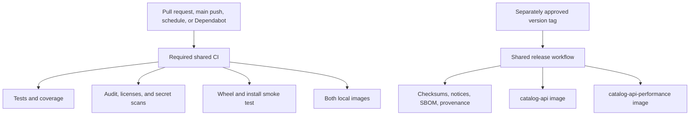

# Release compliance

The repository has one wheel and two OCI images: `catalog-api` and
`catalog-api-performance`. All release work is local or a dry run until an operator separately
approves a version tag and publication.

## Local gates

- `just format-check`, `just lint`, and `just contract-check` are focused, locked source checks;
  `just source-check` composes those three capabilities.
- `just test` executes the suite with coverage, while `just coverage` is an alias rather than a
  second copy of the command. It excludes the `integration` marker, so nothing it runs needs a
  live database.
- `just test-integration` is the engine-backed suite and is **not** part of `just check` or of
  shared CI. It needs Docker, starts throwaway PostgreSQL and Neo4j containers, applies the
  authoritative schema from `groovemap-music/database-schema` at the revision
  `contracts/persistence/v1/source.json` records, and runs `tests/test_real_databases.py`
  against them. Run it locally before submitting a change to the collection sync or to the
  native identity read paths; it is the only gate that proves those statements against the
  real tables rather than a mock.
- `just secret-scan` is the narrow gitleaks capability used by both local and shared CI gates.
- `just check` runs formatting, linting, type checks, the complete test suite, secret scans,
  wheel construction, installed-wheel smoke tests, dependency-license policy, and version checks.
- `just audit` checks the locked environment for known vulnerabilities.
- `just coverage` produces `coverage.xml`, which CI always retains and uploads to Codecov.
- `just image` and `just performance-image` build the repository-named local images from a clean
  commit and inject the exact source revision.
- `just release-dry-run` creates the wheel, source archive, checksums, third-party notice, SBOM,
  and provenance locally. It does not commit, tag, push, publish, or create a release.

The thin workflow callers pin `groovemap-music/automation` by a reviewed forty-character commit.
**Public-library cutover: complete.** The Python-library checkout is public, pinned to an
immutable revision, and requires no private-package credentials. Pull requests from Dependabot
use the ordinary `pull_request` event and the same `required` job, commands, and result job as
every other pull request. The release callers retain the supported `prepare-image-command`
interface so both public library wheels are built into the local image context.

## Publication boundary

The tag workflow is dormant until a separately approved `v*` tag exists. Repository visibility,
tag creation, GHCR publication, and release creation are not performed by local validation.
